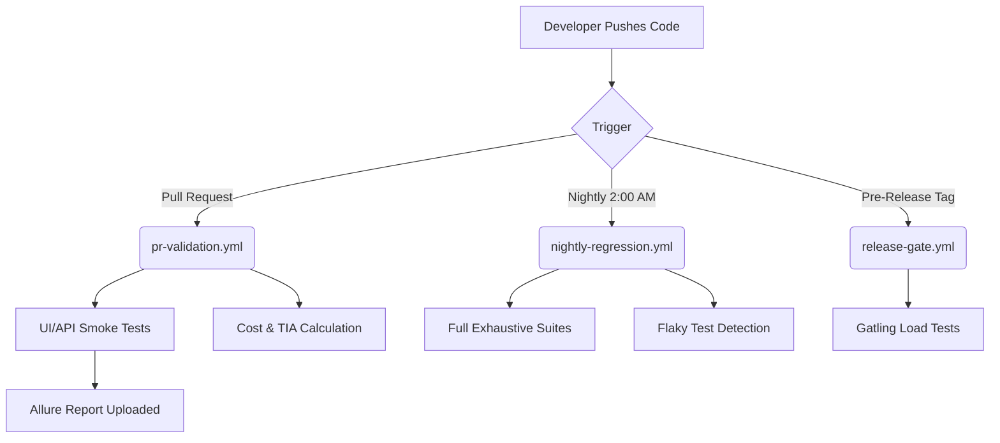

# 🚀 Automation Exercise - Enterprise Quality Engineering Platform

Welcome to the **Automation Exercise QE Platform**, a highly advanced, massively scalable, and modular software testing infrastructure. This project is engineered to provide military-grade reliability for web applications by covering every conceivable layer of the testing pyramid.

---

## 🏗️ The Multi-Module Architecture

The platform is designed around strict separation of concerns, heavily utilizing Maven to break down the monolithic testing framework into specific, high-performance modules.

> [!NOTE]
> **Why Modular?** By breaking tests into modules, CI/CD pipelines can execute specific tests (like API vs UI) in parallel, dramatically decreasing test execution time and cloud billing costs.

### 1. `qe-core` (The Heart) ⚙️
This is the central engine that powers the entire repository. It contains no tests of its own, but holds all the vital utilities:
- **`EnvironmentConfig`**: Dynamically switches between QA, Staging, and Production environments.
- **`DriverFactory`**: A sophisticated WebDriver manager that handles local browsers, headless instances, and Dockerized Selenium Grid scaling.
- **`UserDataGenerator`**: Faker implementations for dynamic test data.

### 2. `qe-ui` (Functional E2E) 🖥️
This module uses Selenium WebDriver to interact with the application like a real human. 
- Implements a strict **Page Object Model (POM)**.
- Organized into **Smoke**, **Exhaustive**, **Negative**, and **Misc** test suites.
- Validates everything from simple logins to complex, cross-cutting account deletion workflows.

### 3. `qe-api` (Backend Integration) 🔌
This module bypasses the frontend entirely to validate the backend business logic at lightning speed.
- Powered by **REST-Assured**.
- Validates 100% of the documented API endpoints (1-14).
- Tests for positive assertions (`200 OK`) and strict negative error handling (`400`, `404`, `405`).

### 4. `qe-load` (Performance & Stress) 📉
Ensures the servers won't crash when traffic spikes.
- Powered by **Gatling** (Scala/Java API).
- Contains advanced strategies: **Spike Testing** (200 instant users), **Stress Testing** (ramping to 500 users), and **User Journey** mapping.

### 5. `qe-contracts` (Consumer-Driven Contracts) 🤝
- Powered by **Pact**.
- Ensures that the UI and the API developers are perfectly aligned on the JSON schemas, preventing costly integration bugs before they are ever deployed.

### 6. `qe-intelligence` (AI & Analytics) 🧠
The brain of the platform. A collection of Python scripts designed to provide next-level observability.
- Calculates Cloud execution costs.
- Detects and quarantines **Flaky Tests** automatically.
- Analyzes Test Impact to predict which tests actually need to run based on recent code commits.

---

## ☁️ Continuous Integration (GitHub Actions)

This platform isn't just code; it's a living, breathing cloud infrastructure. 

### The Workflows:
1. **PR Validation**: Runs fast Smoke tests and uses Python to calculate the exact dollar cost of the test run, posting it directly to the Pull Request.
2. **Nightly Regression**: Runs the massive UI and API exhaustive suites while developers sleep, utilizing Docker Compose to spin up a Selenium Grid.
3. **Release Gate**: Executes the high-concurrency Gatling performance tests to ensure SLA boundaries (< 3 second response times) are met before going to Production.

---

## 📊 Observability & Reporting

When tests fail, debugging needs to be instant.

> [!TIP]
> The platform natively integrates with **Allure Reports**, providing beautiful, graphical dashboards detailing exact failure points, HTTP logs, and screenshot attachments.

For advanced metrics, the platform spins up an **ELK Stack** (Elasticsearch, Logstash, Kibana) and **Prometheus** via Docker Compose (`observability/`). This allows engineers to track real-time grid utilization, container health, and long-term flakiness trends across thousands of test executions.
