# 🧠 Global-Scale Quality Engineering Intelligence Platform

## Target System: AutomationExercise.com E-Commerce Platform

> Designing a self-optimizing, cost-aware, intelligent Quality Engineering Platform operating at FAANG production scale — not a test automation framework.

---

## System Under Test — Domain Analysis

| Domain | Surface Area |
|---|---|
| **Product Catalog** | 34+ products, 3 categories (Women/Men/Kids), 8 brands, detail pages, overlays |
| **Authentication** | Signup, Login, Logout, Account deletion |
| **Cart System** | Add-to-cart, view cart, quantity management, cart modal |
| **Checkout Flow** | Address, payment (mocked), order confirmation |
| **Search** | Product search by keyword |
| **Contact Us** | Form submission with file upload |
| **Subscription** | Email subscription footer widget |
| **API Surface** | 14 documented REST endpoints (Products, Brands, Search, Auth, Account CRUD) |
| **Navigation** | Home, Products, Cart, Login, Test Cases, API List, Video Tutorials, Contact |

---

## 🏗️ 1. SYSTEM-LEVEL ARCHITECTURE

### 1.1 Full Ecosystem Overview

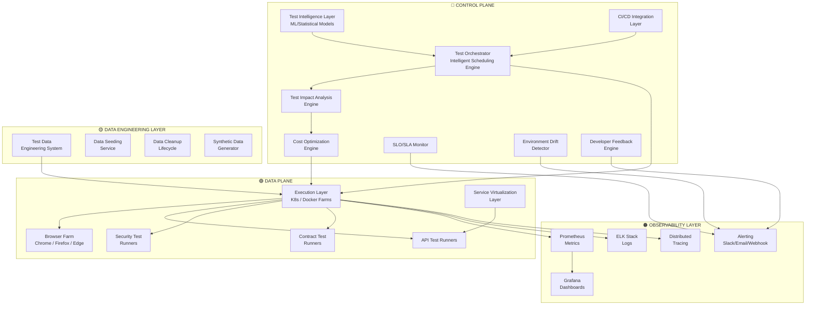

### 1.2 Control Plane vs Data Plane Separation

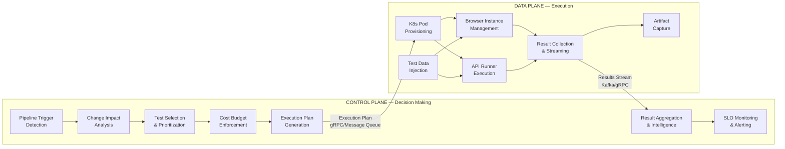

> [!IMPORTANT]
> **Why this separation matters at FAANG scale:** The Control Plane can scale independently from execution. You can have one centralized orchestrator managing 10,000 parallel runners across 5 regions. The Data Plane can auto-scale to zero when idle, eliminating cost. This is identical to how Kubernetes itself separates its own control plane from worker nodes.

### 1.3 Component Responsibilities

| Layer | Component | Responsibility |
|---|---|---|
| **Control Plane** | Test Orchestrator | Receives CI triggers, builds execution plans, manages scheduling queues |
| **Control Plane** | Impact Analysis Engine | Maps code changes → test subsets using dependency graphs |
| **Control Plane** | Intelligence Layer | Flaky detection, failure clustering, health scoring, predictions |
| **Control Plane** | Cost Engine | Enforces budget per pipeline, optimizes test ordering |
| **Control Plane** | SLO Monitor | Tracks execution latency, reliability, flakiness against targets |
| **Data Plane** | K8s Executor | Provisions pods, manages browser/runner lifecycle |
| **Data Plane** | Browser Farm | Manages Chrome/Firefox/Edge pools with Selenium Grid 4 |
| **Data Plane** | API Runners | Headless HTTP execution (RestAssured, custom clients) |
| **Data Plane** | Service Virtualization | WireMock/MockServer for external dependency isolation |
| **Data** | Test Data System | Synthetic generation, seeding, cleanup across environments |
| **Observability** | Full Stack | Prometheus + Grafana + ELK + Distributed Tracing + Alerting |

---

## 💰 2. COST ENGINEERING + TEST OPTIMIZATION LAYER

### 2.1 Cost vs Confidence Tradeoff Model

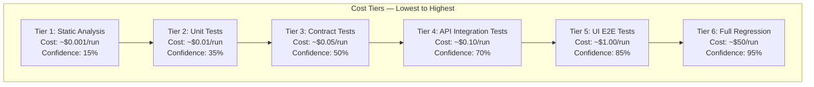

### 2.2 Smart Test Prioritization Engine

The prioritization engine assigns a **Priority Score** to each test using:

```
PriorityScore = (FailureProbability × BusinessImpact × ChangeProximity) / ExecutionCost
```

| Factor | Weight | Description |
|---|---|---|
| **FailureProbability** | 0.35 | Historical failure rate × recent code change correlation |
| **BusinessImpact** | 0.30 | Revenue-critical path weight (checkout = 10, contact = 2) |
| **ChangeProximity** | 0.25 | Distance in dependency graph from changed code |
| **ExecutionCost** | 0.10 | Normalized compute cost (API = 0.1, UI = 1.0) |

**Execution Order Strategy (applied to AutomationExercise.com):**

1. **Smoke (< 2 min):** API health check → Login API → Products API → Homepage load
2. **API Integration (< 5 min):** All 14 API endpoints, CRUD lifecycle, search validation
3. **Contract (< 3 min):** API response schema validation for all endpoints
4. **Impacted UI (< 15 min):** Only UI tests mapped to changed code paths
5. **Full UI Regression (< 40 min):** All E2E flows across browser matrix
6. **Exploratory/Security (< 20 min):** RBAC, injection, auth bypass tests

### 2.3 Risk-Based Execution Strategy

| Risk Level | Trigger Condition | Execution Scope | Budget Cap |
|---|---|---|---|
| **🟢 Low** | Config change, docs update | Smoke + impacted API tests | $2/pipeline |
| **🟡 Medium** | Service logic change | Smoke + API + impacted UI | $15/pipeline |
| **🟠 High** | Core module change (auth, cart, checkout) | Full API + targeted UI + security | $35/pipeline |
| **🔴 Critical** | Release candidate, hotfix | Full regression + all browsers + security | $75/pipeline |

### 2.4 Execution Budget Enforcement

```
Pipeline Budget = BaseAllocation + (RiskMultiplier × ChangeScope)

If projected_cost > budget:
    1. Drop lowest-priority UI tests first
    2. Reduce browser matrix (Chrome-only)
    3. Skip non-critical negative scenarios
    4. Alert team with cost projection vs budget
```

> [!TIP]
> At FAANG scale, cost engineering saves millions annually. Google's TAP system runs ~4.2 billion test cases per day — without intelligent selection, compute costs would be astronomical. Our system mirrors this philosophy: **run the minimum tests to achieve maximum confidence.**

### 2.5 Cost Model with Real Numbers (GKE Baseline)

**Infrastructure Cost Basis (Google Kubernetes Engine):**

| Resource | On-Demand Price | Spot/Preemptible Price | Savings |
|---|---|---|---|
| **vCPU-hour** (e2-standard) | $0.033 | $0.010 (70% discount) | 70% |
| **GB-RAM-hour** | $0.004 | $0.001 | 75% |
| **SSD Storage** (per GB-month) | $0.170 | — | — |
| **Artifact Storage** (Cloud Storage per GB-month) | $0.020 | — | — |
| **Selenium Grid 4** | Open-source ($0) | — | 100% |
| **Network Egress** (per GB, same region) | $0.01 | — | — |

**Cost Per Test Type (computed):**

| Test Type | Duration | Resources | Cost (On-Demand) | Cost (Spot) |
|---|---|---|---|---|
| **Unit/Contract Test** | 15 sec | 0.5 vCPU, 256 MB | $0.0003 | $0.0001 |
| **API Integration Test** | 30 sec | 1 vCPU, 512 MB | $0.01 | $0.003 |
| **UI Test (Chrome)** | 3 min | 2 vCPU, 2 GB | $0.33 | $0.10 |
| **UI Test (Firefox)** | 3.5 min | 2 vCPU, 2 GB | $0.39 | $0.12 |
| **Security Test** | 1 min | 1 vCPU, 1 GB | $0.06 | $0.02 |

**Full Regression Cost Breakdown (340 tests):**

```
Test Mix:
  42 Auth tests (30 API + 12 UI)        = 30 × $0.01 + 12 × $0.33 = $4.26
  35 Product tests (20 API + 15 UI)      = 20 × $0.01 + 15 × $0.33 = $5.15
  28 Cart tests (8 API + 20 UI)          = 8 × $0.01 + 20 × $0.33  = $6.68
  22 Checkout tests (5 API + 17 UI)      = 5 × $0.01 + 17 × $0.33  = $5.66
  12 Search tests (4 API + 8 UI)         = 4 × $0.01 + 8 × $0.33   = $2.68
  14 Contact/Sub tests (6 API + 8 UI)    = 6 × $0.01 + 8 × $0.33   = $2.70
  15 Security tests                      = 15 × $0.06              = $0.90
  10 Performance tests                   = 10 × $0.06              = $0.60
  14 Contract tests                      = 14 × $0.0003            = $0.004
  ─────────────────────────────────────────────────────────────────
  Single browser total:                                             ≈ $28.63

Matrix Execution:
  3 browsers × $28.63 = $85.89 per full release regression
  52 releases/year × $85.89 = $4,466/year (infrastructure only)

With Spot Instances (70% savings):
  $85.89 × 0.30 = $25.77 per release
  52 × $25.77 = $1,340/year
```

**ROI Calculation:**

```
Platform Investment (Year 1):
  6 engineers × $200,000 avg loaded cost     = $1,200,000
  Infrastructure (GKE + storage + monitoring) = $25,000
  Tooling licenses (Allure EE, etc.)          = $15,000
  Total platform cost:                        = $1,240,000

Savings Generated:
  Developer unblock time:
    100 developers × 2 hours/day saved × $75/hour × 250 days = $3,750,000
  Faster release cycles:
    50% faster releases × 4 releases/month × $10,000 opportunity cost = $480,000
  Bug detection shift-left:
    200 bugs caught earlier × $5,000 avg cost-to-fix savings = $1,000,000
  Reduced production incidents:
    30% fewer incidents × 24 incidents/year × $25,000 avg cost = $180,000
  Total savings:                              = $5,410,000

Net ROI: ($5,410,000 - $1,240,000) / $1,240,000 = 336% Year 1 ROI
```

**Monthly Spend by Phase:**

| Phase | Infrastructure | Tooling | Engineering | Total/Month |
|---|---|---|---|---|
| **Phase 0** (MVP) | $0 (local) | $0 (OSS) | 2 FTE ($33K) | $33,000 |
| **Phase 1** (Intelligence) | $500 (Docker) | $200 (Allure) | 3 FTE ($50K) | $50,700 |
| **Phase 2** (Distributed) | $2,000 (GKE) | $500 (monitoring) | 5 FTE ($83K) | $85,500 |
| **Phase 3** (Enterprise) | $5,000 (multi-region) | $1,200 (full stack) | 6 FTE ($100K) | $106,200 |

---

## 📊 3. SLO / SLA FOR TESTING SYSTEM

### 3.1 Service Level Objectives

| SLO | Target | Measurement | Burn Rate Alert |
|---|---|---|---|
| **Smoke Suite Latency** | p95 < 10 minutes | Time from trigger → green/red signal | > 12 min triggers warning |
| **Full Regression Latency** | p95 < 60 minutes | Full suite wall-clock time | > 75 min triggers warning |
| **Execution Reliability** | 99.0% | `successful_runs / total_runs` (30-day rolling) | < 98% triggers incident |
| **Flaky Test Rate** | < 2.0% | `flaky_tests / total_tests` (7-day rolling) | > 3% triggers quarantine sweep |
| **API Test p50 Latency** | < 3 minutes | API-only suite execution time | > 5 min triggers investigation |
| **Test Result Delivery** | p95 < 5 minutes post-completion | Time from last test → PR comment posted | > 8 min triggers alert |
| **Infrastructure Availability** | 99.5% | Selenium Grid + K8s uptime | < 99% triggers capacity review |

### 3.2 SLO Monitoring Architecture

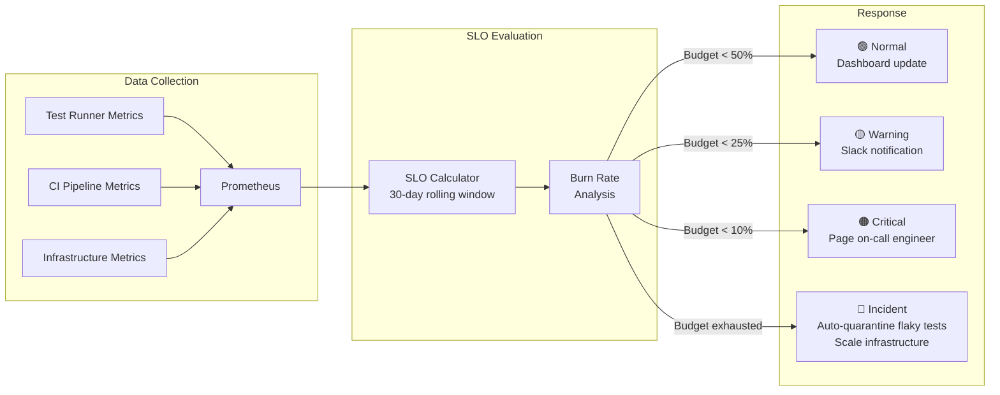

### 3.3 SLO Violation Response Playbook

| Violation | Auto-Response | Manual Escalation |
|---|---|---|
| Smoke > 10 min | Re-route to faster runner pool; cache warm-up | Review smoke test scope |
| Regression > 60 min | Increase parallelism; split shards | Review test count, identify slow tests |
| Reliability < 99% | Auto-quarantine top 5 flakiest tests | Root cause investigation sprint |
| Flaky > 2% | Auto-quarantine; increase retry budget | Flaky test war room (weekly) |

#### 3.3.1 Detailed Playbook: Smoke Latency p95 > 12 min (Warning) / > 15 min (Critical)

**Immediate (0-5 min):**
- Auto-response: check queue depth; if > 50 pending tests → trigger HPA scale-up to max pods
- Check: is baseline normal for current load? (compare to 7-day rolling average)
- Dashboard: open Grafana "Pod Utilization" and "Grid Session Queue" panels

**Investigation (5-10 min):**
- Review: any new tests added to smoke suite this week? (`git log --since='7 days' -- src/test/**/smoke/`)
- Metrics: are pods waiting for grid sessions? (Grid capacity > 90%?)
- Check node health: any K8s node in `NotReady` status?
- Query: `increase(test_execution_duration_seconds_sum{suite="smoke"}[7d])` — is there a gradual regression?

**Escalation (> 10 min unresolved):**
- PagerDuty: page on-call SRE (Severity P2)
- Pause: temporarily disable low-priority nightly regressions to free grid capacity
- Communication: update `#qe-alerts` Slack channel with ETA and root cause hypothesis

#### 3.3.2 Detailed Playbook: Execution Reliability < 99% (Critical)

**Root cause bucket identification:**

| Bucket | Detection Query | Probability |
|---|---|---|
| **Flaky tests** | `failure_rate > 2σ above baseline` per test | 50% |
| **Infrastructure** | Grid session timeouts, pod OOMKilled, node evictions | 25% |
| **Environment drift** | Drift detector alerts in last 24h | 15% |
| **Code regression** | Failure rate high on new branches only | 10% |

**Response chain:**
1. **Auto-action (immediate):** Auto-quarantine top 5 tests by failure rate
2. **Investigation (5 min):** Run failure clustering → identify common root cause signature
3. **Infra check (10 min):** Query `kube_pod_container_status_restarts_total` for crash loops
4. **Escalation (30 min unresolved):** Page Tech Lead + QE Lead, create P1 incident

#### 3.3.3 Detailed Playbook: Flaky Rate > 3% (Warning)

**Immediate:** Auto-quarantine all tests with FI ≥ 0.05 (see §7.6 Quarantine Policy)
**Investigation:** Generate flaky test report sorted by `FI × execution_frequency`
**Weekly:** Flaky test war room — review top 10 flakiest tests, assign owners, set 7-day SLA
**Monthly:** If flaky rate sustained > 2%: schedule "Flaky Test Fix Sprint" (dedicated 2-day effort)

#### 3.3.4 Detailed Playbook: Grid Utilization > 90% (Warning)

**Auto-response:** Trigger cluster auto-scaler to add 5 nodes (takes ~3 min on GKE)
**Immediate:** Pause nightly regression if running during business hours
**Investigation:** Check if specific pipeline is monopolizing grid (resource quota enforcement)
**Escalation:** If sustained > 95% for 30 min → page SRE, consider burst capacity activation

#### 3.3.5 MTTR (Mean Time to Recovery) Targets

| Severity | MTTR Target | Escalation Path |
|---|---|---|
| **P1** (Platform Down) | < 30 minutes | On-call SRE → QE Lead → VP Eng |
| **P2** (SLO Breach) | < 2 hours | On-call QE → QE Lead |
| **P3** (Warning) | < 24 hours | QE team async |
| **P4** (Info) | Next sprint | Backlog |

---

## 🔍 4. TEST IMPACT ANALYSIS ENGINE

### 4.1 Architecture

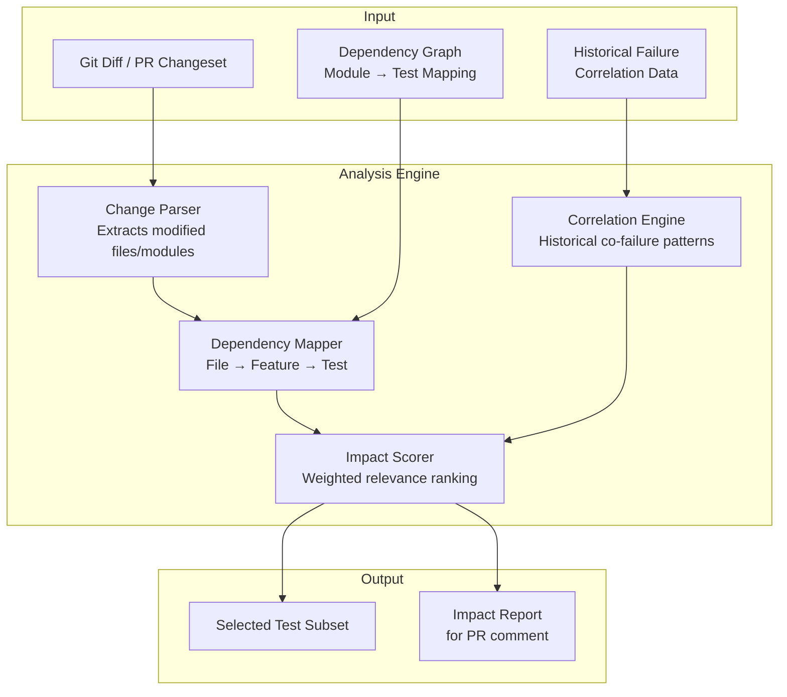

### 4.2 Dependency Graph for AutomationExercise.com

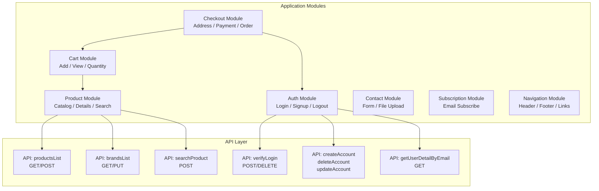

### 4.3 Test Selection Computation

**Step 1 — Static Analysis:** Parse git diff → identify changed files/functions

**Step 2 — Module Mapping:** Map changed files → application modules using maintained dependency graph:

| Changed File/Module | Impacted Tests |
|---|---|
| `auth/*` | All auth API tests, login UI tests, checkout E2E (requires auth) |
| `product/*` | Product API tests, catalog UI tests, search tests, cart tests (depends on products) |
| `cart/*` | Cart API/UI tests, checkout E2E tests |
| `checkout/*` | Checkout E2E, payment mocking tests |
| `api/routes/*` | All API contract tests, related integration tests |
| `css/styling/*` | Visual regression tests only |

**Step 3 — Historical Correlation:** For any `file_X` change, query: *"In the last 90 days, which tests failed when `file_X` was modified?"* This captures implicit dependencies the static graph misses.

**Step 4 — Score & Select:** Combine static + historical signals. Select all tests with `impact_score > 0.3`.

### 4.4 Cost/Time Reduction Impact

| Scenario | Without TIA | With TIA | Savings |
|---|---|---|---|
| Auth module change | 340 tests (45 min) | 48 tests (8 min) | **82% time, 86% cost** |
| CSS-only change | 340 tests (45 min) | 12 visual tests (3 min) | **93% time, 96% cost** |
| Product catalog change | 340 tests (45 min) | 85 tests (15 min) | **67% time, 75% cost** |
| Full checkout refactor | 340 tests (45 min) | 340 tests (45 min) | 0% (correct: full run needed) |

### 4.5 Contract Testing Strategy

#### 4.5.1 Approach: Consumer-Driven Contracts (Pact)

**Why Consumer-Driven over Provider-Driven:**

| Approach | Pros | Cons | Verdict |
|---|---|---|---|
| **Consumer-Driven (Pact)** | UI team defines what APIs they need; prevents silent breaking changes; enables independent deployment | Requires consumer team discipline | ✅ **Selected** |
| **Provider-Driven (Spring Cloud Contract)** | API team owns contracts; simpler for API-first design | Consumer surprises possible; tight coupling | ❌ Rejected |

**Rationale:** For AutomationExercise.com, the UI consumer needs drive API contract expectations. If the API removes a field (`sku`, `price`, `category`), the UI tests should detect this before deployment — not after.

#### 4.5.2 Pact Workflow

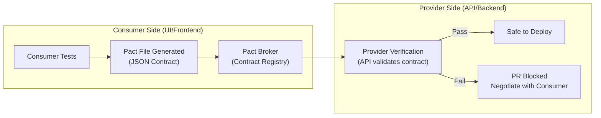

#### 4.5.3 Contract Definitions for AutomationExercise.com

| API Endpoint | Consumer Expectation | Contract Validates |
|---|---|---|
| `GET /api/productsList` | Response contains `products[]` with `id`, `name`, `price`, `category` | Schema structure, required fields, data types |
| `GET /api/brandsList` | Response contains `brands[]` with `id`, `brand` | Schema structure, non-empty array |
| `POST /api/searchProduct` | Response contains matching products with `search_product` param | Parameter acceptance, response format |
| `POST /api/verifyLogin` | Returns `responseCode: 200` with valid creds | Response codes for valid/invalid/missing params |
| `POST /api/createAccount` | Returns `responseCode: 201` on success | All 17 parameters accepted, success response |
| `PUT /api/updateAccount` | Returns `responseCode: 200` on update | Update semantics preserved |
| `DELETE /api/deleteAccount` | Returns `responseCode: 200` on deletion | Deletion with correct credentials |
| `GET /api/getUserDetailByEmail` | Returns user detail JSON with all profile fields | Response shape matches account creation |

#### 4.5.4 Breaking Change Escalation Example

```
Scenario:
  1. UI test adds expectation: GET /api/productsList response includes 'brand' field
  2. Pact file generated → published to Pact Broker
  3. API team deploys change that renames 'brand' → 'brandName'
  4. Provider verification runs against pact → FAILS
  5. API team's PR is BLOCKED
  6. API team must:
     a. Restore 'brand' field (backward compatible), OR
     b. Negotiate with UI team → UI team updates consumer pact
  7. Both sides update → contracts align → deployment unblocked

Result: Zero silent breaking changes. Both teams are always aligned.
```

#### 4.5.5 Contract Test Maintenance

- **Ownership:** Consumer team owns pact generation; provider team owns verification
- **Storage:** Pact files in Pact Broker (self-hosted or PactFlow SaaS)
- **CI Integration:** Consumer pacts generated in pre-merge; provider verification in post-merge
- **Versioning:** Pacts tagged with consumer version + branch for multi-version support

---

## 🧪 5. SERVICE VIRTUALIZATION LAYER

### 5.1 Architecture

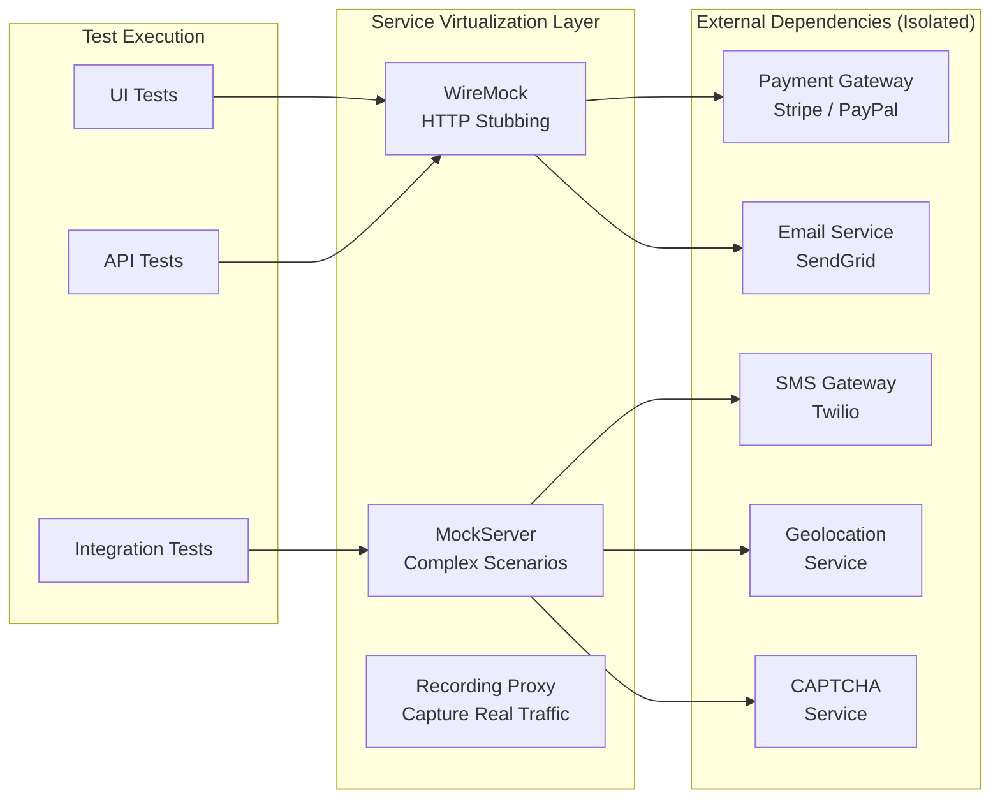

### 5.2 Virtualization Strategy for AutomationExercise.com

| External Dependency | Mock Strategy | Tool | Why Isolate |
|---|---|---|---|
| **Payment Processing** | Stub successful/failed/timeout responses | WireMock | Cannot hit real payment in tests; cost + side effects |
| **Email Delivery** | Capture email content, validate templates | MockServer | Verify email triggered without sending |
| **CAPTCHA** | Always return success in test environments | WireMock | CAPTCHA blocks automation by design |
| **CDN/Image Delivery** | Stub with local placeholders | WireMock | Reduce external network dependency |
| **Analytics/Tracking** | Sink all requests silently | WireMock | Prevent test pollution of analytics data |

### 5.3 Why External Isolation is Critical

> [!WARNING]
> **Without service virtualization, tests are non-deterministic.** A payment gateway timeout at 3 AM causes your test suite to fail — not because of a bug, but because of an external dependency. This creates phantom failures, wastes engineering time, and erodes trust in the test suite. At FAANG scale, non-deterministic tests are actively harmful because they train engineers to ignore failures.

**Key benefits:**
- **Determinism:** Tests produce same results regardless of external system state
- **Speed:** No network round-trips to external services (p99 latency drops 10x)
- **Cost:** No per-call charges to third-party APIs during testing
- **Parallelism:** Each test runner gets its own isolated mock — no shared state

---

## 🔐 6. SECURITY & ACCESS CONTROL TESTING LAYER

### 6.1 Security Test Strategy

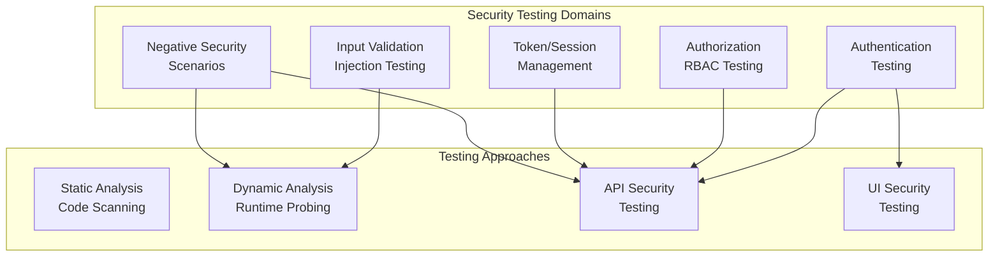

### 6.2 Authentication Testing Matrix

| Test Category | API Tests | UI Tests | Negative Tests |
|---|---|---|---|
| **Login Valid** | POST `/api/verifyLogin` with valid creds → 200 | UI login flow → logged-in state | — |
| **Login Invalid** | POST `/api/verifyLogin` invalid creds → 404 | UI error message displayed | SQL injection in email field |
| **Login Missing Params** | POST `/api/verifyLogin` missing email → 400 | Submit empty form → client validation | — |
| **Login Wrong Method** | DELETE `/api/verifyLogin` → 405 | — | Method enumeration probe |
| **Signup** | POST `/api/createAccount` → 201 | Full signup flow | Duplicate email, XSS in name field |
| **Delete Account** | DELETE `/api/deleteAccount` → 200 | UI account deletion | Attempt delete of other user's account |
| **Update Account** | PUT `/api/updateAccount` → 200 | Profile update flow | IDOR: update another user's profile |

### 6.3 Permission Matrix Validation (RBAC)

| Action | Guest | Authenticated User | Expected Behavior |
|---|---|---|---|
| View products | ✅ | ✅ | Products visible to all |
| Add to cart | ✅ | ✅ | Cart accessible to all |
| Checkout | ❌ → Redirect to login | ✅ | Auth required for purchase |
| View account details | ❌ → 401/redirect | ✅ Own data only | No cross-user access |
| Delete account | ❌ | ✅ Own account only | Cannot delete others |
| API: getUserDetailByEmail | — | ✅ Own email only | Test IDOR vulnerability |

### 6.4 Negative Security Scenarios

| Scenario | Target | Payload | Expected Response |
|---|---|---|---|
| SQL Injection | Login email field | `' OR 1=1 --` | Rejected, no data leak |
| XSS Stored | Contact form message | `<script>alert('xss')</script>` | Sanitized output |
| XSS Reflected | Product search | `` | Sanitized output |
| CSRF | Account delete | Forged cross-origin request | Rejected (CSRF token validation) |
| Path Traversal | Product image URL | `../../etc/passwd` | 404 or sanitized |
| Parameter Tampering | Cart price | Modified price in request | Server-side price enforcement |
| Rate Limiting | Login endpoint | 100 requests in 10 seconds | Rate limited after threshold |

---

## 🧠 7. TEST INTELLIGENCE SYSTEM

### 7.1 Intelligence Architecture

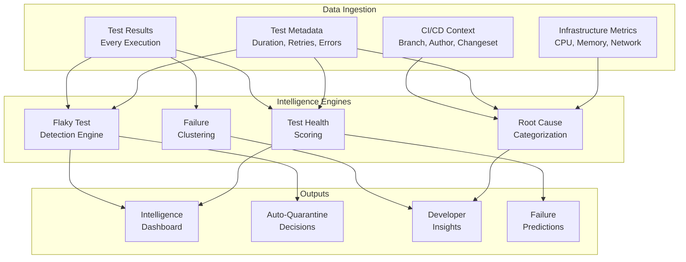

### 7.2 Flaky Test Detection Engine

**Statistical Model:**
```
FlakinessIndex(test) = (flip_count / total_runs) × recency_weight

Where:
- flip_count = number of pass↔fail transitions in sliding window (30 days)
- total_runs = total executions in window
- recency_weight = exponential decay favoring recent data (λ = 0.95)

Classification:
- FI < 0.02 → Stable ✅
- 0.02 ≤ FI < 0.05 → Watch 👀
- 0.05 ≤ FI < 0.10 → Flaky ⚠️ (auto-quarantine candidate)
- FI ≥ 0.10 → Toxic 🔴 (auto-quarantine + alert)
```

**Historical Enrichment:**
- Track retry patterns: tests that pass on 2nd/3rd attempt are flaky candidates
- Correlate with infrastructure events: if failures cluster around specific runner nodes, it's infra-flakiness
- Time-of-day analysis: tests failing only during peak traffic hours suggest environment contention

### 7.3 Failure Clustering System

| Cluster Method | Signal | Action |
|---|---|---|
| **Error Signature** | Group by exception type + stack trace hash | Deduplicate failures, single root cause |
| **Temporal Clustering** | Tests failing in same time window | Infrastructure issue probable |
| **Module Clustering** | Tests in same feature area failing | Code regression in that module |
| **Infrastructure** | Tests failing on specific nodes/browsers | Node health issue |

### 7.4 Root Cause Categorization

| Category | Detection Signal | Auto-Action |
|---|---|---|
| **Code Regression** | Tests pass on base branch, fail on PR branch | Block merge, notify author |
| **Environment Issue** | Same tests pass in other environments | Alert infra team |
| **Test Flakiness** | Intermittent pass/fail, passes on retry | Quarantine, track FI score |
| **Data Dependency** | Fails after other test's data corruption | Isolate test data |
| **Infrastructure** | Timeout/connection errors, not assertion failures | Alert infra, reroute |
| **External Dependency** | Failures in mocked service responses | Review mock configurations |

### 7.5 Test Health Metrics

| Metric | Formula | Threshold |
|---|---|---|
| **Stability Score** | `1 - (failures / total_runs)` per test (90 days) | Green > 0.98, Yellow > 0.95, Red < 0.95 |
| **Flakiness Index** | See §7.2 above | Quarantine at ≥ 0.05 |
| **Failure Entropy** | `H = -Σ p(category) × log₂(p(category))` per module | High entropy = diverse failure types = investigate |
| **Mean Execution Time Regression** | `(current_p50 - baseline_p50) / baseline_p50` | Alert if > 20% regression |
| **Retry Rate** | `retried_executions / total_executions` | Alert if > 5% |

### 7.6 Flaky Test Quarantine Policy

> [!IMPORTANT]
> **Policy Statement:** Any test with Flakiness Index ≥ 0.05 is auto-quarantined for a maximum of 14 days. Quarantined tests are excluded from PR gates but still execute in Release pipelines. If a quarantined test fails at release time, it requires Tech Lead + QE Lead approval to proceed. Quarantine is lifted when FI drops below 0.03, verified over a minimum 7-day observation window with ≥ 20 executions.

#### 7.6.1 Quarantine Trigger Decision Tree

```
On FI recalculation (daily, 30-day sliding window):

  FI < 0.02 → STABLE
    → No action

  0.02 ≤ FI < 0.05 → WATCH
    → Add to watch list
    → Slack notification to test owner: "Test X trending flaky (FI: 0.04)"
    → No pipeline impact (still runs, still blocks)

  0.05 ≤ FI < 0.10 → FLAKY → AUTO-QUARANTINE
    → Automatically quarantine
    → Remove from PR pipeline blocking gates
    → Create GitHub Issue (auto-assigned to test owner)
    → Slack: #qe-flaky channel notification
    → Still runs in Release/Canary pipelines (non-blocking, reported)

  FI ≥ 0.10 → TOXIC → IMMEDIATE QUARANTINE + ALERT
    → Immediately quarantine + remove from ALL non-release pipelines
    → Page test owner via Slack DM
    → Escalate to QE Lead if no response in 24h
    → P2 severity — requires fix or deletion within 7 days
```

#### 7.6.2 Quarantine Duration & Lifecycle

| State | Duration | Pipeline Behavior | Owner Action Required |
|---|---|---|---|
| **Quarantined** | Max 14 days | Skipped in PR pipelines; runs in Release (non-blocking) | Investigate + fix root cause |
| **Extension Requested** | +7 days (1 extension max) | Same as quarantined | Owner submits extension justification |
| **Expired (unfixed)** | After 14 days (or 21 with extension) | Test DELETED from suite | Owner must rewrite test or justify permanent removal |
| **Fix Verified** | 7-day observation period | Runs in shadow mode (non-blocking) | Monitor FI daily |
| **Restored** | FI < 0.03 for 7 days, ≥ 20 executions | Fully restored to blocking pipelines | None |

#### 7.6.3 Quarantine Behavior Per Pipeline Type

| Pipeline Type | Quarantined Test Behavior | Failure Impact |
|---|---|---|
| **PR / Pre-merge** | ❌ Skipped entirely | None — does not block merge |
| **Post-merge (main)** | ⚠️ Runs, results logged | Non-blocking — contributes to FI calculation |
| **Release / Canary** | ✅ Runs, results reported | Non-blocking by default; **manual override required** if fails |
| **Nightly Regression** | ✅ Runs, results logged | Non-blocking — used for FI observation |

#### 7.6.4 Ownership & Escalation SLA

| Timeline | Action | Owner |
|---|---|---|
| **Day 0** | Auto-quarantine triggered; GitHub Issue created | System (automated) |
| **Day 1** | Test owner acknowledges issue; begins investigation | Test author / squad QE |
| **Day 3** | Root cause identified; fix in progress | Test author |
| **Day 7** | If no progress: escalate to Squad Lead | QE Platform team |
| **Day 10** | If no progress: escalate to QE Lead | QE Lead |
| **Day 14** | Quarantine expires: test deleted OR extension approved | QE Lead approval |
| **Day 21** | Hard deadline: test removed from suite permanently | Automatic |

#### 7.6.5 Who Investigates?

| Root Cause Category | Primary Investigator | Support From |
|---|---|---|
| **Test logic bug** | Test author (squad QE) | — |
| **Test data issue** | Test author | Data Engineering team |
| **Infrastructure flakiness** | QE Platform team / SRE | Infra team |
| **Application timing issue** | Test author + App developer | — |
| **Environment issue** | QE Platform team | DevOps |
| **Unknown** | QE Platform team (initial triage) | Escalate based on findings |

---

## ⚙️ 8. DISTRIBUTED EXECUTION SYSTEM

### 8.1 Kubernetes-Based Architecture

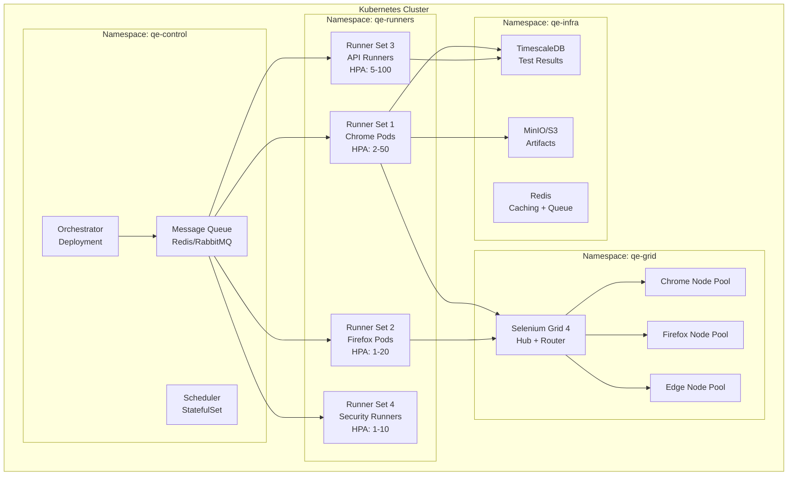

### 8.2 Auto-Scaling Strategy

| Runner Type | Min Pods | Max Pods | Scale Trigger | Scale-Down Delay |
|---|---|---|---|---|
| **Chrome UI** | 2 | 50 | Queue depth > 10 tests pending | 5 min idle |
| **Firefox UI** | 1 | 20 | Queue depth > 5 tests pending | 5 min idle |
| **Edge UI** | 0 | 10 | Explicit matrix request only | Immediate |
| **API Runners** | 5 | 100 | Queue depth > 20 tests pending | 3 min idle |
| **Security Runners** | 1 | 10 | Security suite triggered | 5 min idle |

### 8.3 Load Balancing Strategy

- **Consistent Hashing:** Tests are distributed to runner pods using consistent hashing on test ID. This ensures retry of a specific test goes to the same pod (warm cache).
- **Weighted Round Robin:** API tests weighted 5:1 vs UI tests to fill API runners first (cheaper).
- **Affinity Rules:** Cart/Checkout E2E tests pinned to same pod (session state preservation).

### 8.4 Failure Recovery Strategy

| Failure Type | Detection | Response | Escalation |
|---|---|---|---|
| **Pod crash** | K8s liveness probe | Auto-restart, re-enqueue test | Alert if > 3 restarts in 10 min |
| **Browser crash** | Selenium session timeout | Kill session, retry on new pod | Quarantine test if 3 consecutive failures |
| **Node failure** | K8s node condition | Reschedule pods to healthy nodes | Alert infra team |
| **Grid saturation** | Queue depth sustained > 100 | Trigger burst scaling | Pause low-priority tests |
| **Test timeout** | Configurable per test type | Kill execution, mark as TIMEOUT | Retry once, then quarantine |

### 8.5 Retry vs Quarantine Decision Tree

```
On test failure:
  1. Is this the 1st attempt?
     → Retry once (immediately, same pod)
  2. Is this the 2nd attempt?
     → Retry once (different pod, different browser session)
  3. Failed 3 consecutive times?
     → Mark test as QUARANTINED
     → Remove from blocking pipeline
     → Create tracking ticket
     → Alert test owner
  4. Was it a timeout (not assertion failure)?
     → Retry with 2x timeout budget
     → If still fails → infrastructure investigation
```

### 8.6 Load Testing Cadence & Tooling

#### 8.6.1 When Do We Load Test?

| Trigger | Scope | Frequency | Blocking? |
|---|---|---|---|
| **Baseline Establishment** | Full platform under simulated load | Before each Phase go-live | Yes — must pass before launch |
| **Release Candidate** | Critical paths (auth, checkout, search) | Every release | Yes — blocks release if > 5% failure |
| **Weekly Smoke Load** | API endpoints + Grid concurrency | Weekly (Sunday night) | No — informational, trend tracking |
| **Post-Scaling Change** | Full platform load test | After K8s config changes | Yes — validates scaling behavior |
| **Incident Follow-up** | Specific area related to incident | After P1/P2 resolution | No — validates fix |

#### 8.6.2 Tool Selection

| Tool | Use Case | Rationale | Alternative Considered |
|---|---|---|---|
| **Gatling** (Primary) | API + platform load testing | Java/Scala-based, integrates with existing Maven build; excellent reporting; code-as-test approach | k6 (JS-based, doesn't integrate with Java stack) |
| **Selenium Grid Load** | Browser concurrency testing | Native grid metrics; test real browser scaling | Custom scripts (harder to maintain) |
| **Prometheus + Grafana** | Real-time monitoring during load | Already in observability stack; zero additional cost | Datadog (expensive) |

#### 8.6.3 Target Metrics Under Load

| Metric | Target (Phase 2) | Target (Phase 3) | Measurement |
|---|---|---|---|
| **Throughput** | 50 tests/min sustained | 200 tests/min sustained | Tests completed per minute |
| **Latency (p99)** | < 10 sec per API test | < 8 sec per API test | End-to-end test execution time |
| **Grid Session Wait** | < 30 sec | < 15 sec | Queue time before session starts |
| **Success Rate Under Load** | > 98% | > 99% | Tests passing under concurrent load |
| **CPU Utilization** | < 75% across runner pods | < 70% | K8s metrics per pod |
| **Memory Utilization** | < 80% across runner pods | < 75% | K8s metrics per pod |
| **Scale-up Time** | < 5 min from trigger to ready | < 3 min | Time from HPA trigger to pod running |

#### 8.6.4 Load Test Success Criteria

```
Release Gate Load Test:
  1. Run 340 tests across 3 browsers simultaneously (1,020 total executions)
  2. Must complete within 30 minutes wall-clock time
  3. Failure rate must be < 5%
  4. No pod OOMKilled events
  5. Grid session queue must not exceed 50 pending
  6. If ANY criteria fails → Release blocked → Escalate to QE Lead for waiver
```


## 📊 9. OBSERVABILITY & REAL-TIME MONITORING STACK

### 9.1 Full Observability Architecture

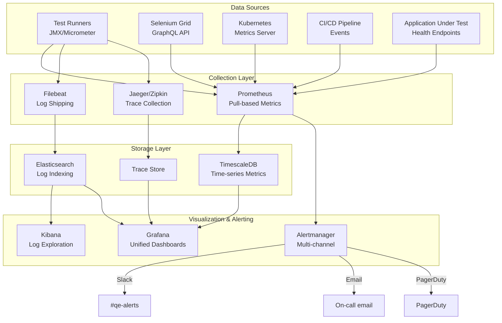

### 9.2 Key Dashboards

| Dashboard | Panels | Purpose |
|---|---|---|
| **Executive Overview** | Pass rate trend, SLO burn, cost/day, flaky count | Leadership visibility |
| **Pipeline Health** | Per-pipeline success rate, duration, cost | CI/CD team monitoring |
| **Test Intelligence** | Flakiness heatmap, failure clusters, health scores | QE team deep-dive |
| **Infrastructure** | Grid utilization, pod count, queue depth, node health | SRE/Infra monitoring |
| **Real-time Execution** | Live test progress, current failures, ETA | Development team during PRs |
| **Environment Status** | Drift detection, config diff, service health | Environment management |

### 9.3 Alerting Rules

| Alert | Condition | Severity | Channel |
|---|---|---|---|
| Smoke suite > 10 min | `smoke_duration_seconds > 600` | Warning | Slack #qe-alerts |
| Execution reliability < 98% | `success_rate_30d < 0.98` | Critical | PagerDuty |
| Grid utilization > 90% | `grid_sessions / grid_capacity > 0.9` | Warning | Slack #infra |
| Flaky rate > 3% | `flaky_tests / total_tests > 0.03` | Warning | Slack #qe-alerts + email |
| Pipeline failure anomaly | `failure_rate > 2 × baseline` in 1 hour | Critical | PagerDuty |
| Runner pod crash loop | `restart_count > 3` in 10 min | Critical | Slack #infra + PagerDuty |

---

## 🚀 10. CI/CD ARCHITECTURE

### 10.1 Pipeline Flow Diagram

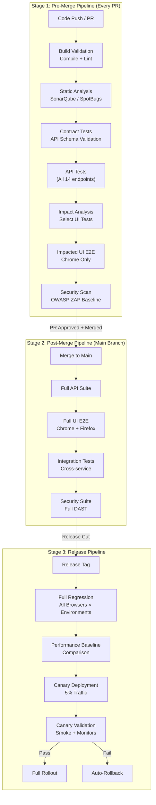

### 10.2 Matrix Execution Strategy

| Dimension | Pre-Merge | Post-Merge | Release |
|---|---|---|---|
| **Browsers** | Chrome only | Chrome + Firefox | Chrome + Firefox + Edge |
| **Environments** | QA | QA + Staging | QA + Staging + Pre-prod |
| **Viewports** | Desktop only | Desktop + Tablet | Desktop + Tablet + Mobile |
| **Parallelism** | 10 workers | 25 workers | 50 workers |
| **Budget** | $5 max | $25 max | $75 max |

### 10.3 Artifact Storage Strategy

| Artifact | Storage | Retention | Purpose |
|---|---|---|---|
| Test reports (HTML/JSON) | S3/MinIO | 90 days | Historical analysis |
| Screenshots on failure | S3/MinIO | 30 days | Debug failed tests |
| Video recordings | S3/MinIO | 7 days | Reproduce flaky tests |
| Console/browser logs | ELK | 30 days | Root cause analysis |
| Performance traces | Jaeger | 14 days | Performance regression detection |
| Test execution metadata | TimescaleDB | 365 days | Intelligence engine training data |

### 10.4 Failure Gating Strategy

| Gate | Blocking Criteria | Override Policy |
|---|---|---|
| **Build Gate** | Compilation failure | No override |
| **Static Analysis Gate** | New Critical/Blocker issues | Tech Lead override only |
| **Contract Test Gate** | Any contract violation | No override (prevents breaking consumers) |
| **API Test Gate** | Any failure (0 tolerance) | Quarantined tests excluded |
| **UI Test Gate** | > 2% failure rate (excluding quarantined) | QE Lead override with justification |
| **Security Gate** | High/Critical vulnerabilities | Security Team override only |

### 10.5 Rollback Strategy

```
Canary Deployment Monitoring (15-minute window):
1. Deploy to 5% of traffic
2. Monitor:
   - Error rate vs baseline (< 0.1% delta allowed)
   - p99 latency vs baseline (< 10% regression allowed)
   - Smoke test execution (must pass)
3. If any threshold breached:
   - Auto-rollback within 60 seconds
   - Alert release channel
   - Create incident
4. If clean for 15 minutes:
   - Proceed to 25% → 50% → 100%
```

### 10.6 Infrastructure Kill Switch & Emergency Bypass

> [!CAUTION]
> **Emergency Bypass Protocol:** This section defines how to ship code when the test infrastructure is completely unavailable. This is a last-resort mechanism with full audit trail requirements.

#### 10.6.1 When Does Emergency Bypass Apply?

| Scenario | Bypass Allowed? | Conditions |
|---|---|---|
| **Test infra completely down** (Grid + K8s + runners) | ✅ Yes | Must be verified by automated canary health check |
| **Tests are flaky / slow** | ❌ No | Use quarantine policy, not bypass |
| **Developer wants to skip tests** | ❌ No | No individual opt-out |
| **Production hotfix (P0 incident)** | ✅ Yes | Time-critical, customer-facing impact |
| **Partial infra degradation** | ❌ No | Run available test subsets instead |

#### 10.6.2 Bypass Activation Protocol

```
Emergency Bypass Activation:

1. DETECTION (Automated):
   - Canary test suite (5 tests, runs every 5 min) fails 3 consecutive times
   - OR: K8s cluster health check returns unhealthy
   - OR: Selenium Grid reports 0 available sessions for > 10 min

2. VERIFICATION (Automated):
   - System confirms: platform is DOWN, not just slow
   - Dashboard shows red status on Infrastructure panel

3. APPROVAL (Manual — BOTH required):
   - Tech Lead approves (recorded in Jira/GitHub issue)
   - QE Lead approves (recorded in same ticket)
   - Approval logged with timestamp, reason, and expected follow-up

4. DEPLOYMENT:
   - Code merges with bypass flag: `EMERGENCY_BYPASS=true`
   - All monitoring alerts suppressed for test-gate only
   - Deployment proceeds with enhanced production monitoring

5. MANDATORY FOLLOW-UP (within 2 hours post-deploy):
   - Full regression run as soon as infra recovers
   - Manual exploratory testing of changed areas
   - If regression finds issues → immediate rollback

6. POSTMORTEM (within 24 hours):
   - Blameless incident postmortem
   - Root cause of infra failure documented
   - Preventive action items created
```

#### 10.6.3 Bypass Audit & Compliance

| Data Point | Stored Where | Retention |
|---|---|---|
| Bypass activation timestamp | Jira ticket + audit log | Permanent |
| Approver identities | Jira ticket | Permanent |
| Reason for bypass | Jira ticket description | Permanent |
| Follow-up regression results | S3 + test results DB | 365 days |
| Postmortem document | Confluence/Wiki | Permanent |
| Bypass count per quarter | Executive dashboard | Permanent |

#### 10.6.4 Prevention & Infrastructure Resilience

- **99.5% availability SLO** for test infrastructure (see §3.1)
- **Automated failover:** If primary K8s cluster is down, route to secondary cluster (different AZ)
- **DR drill:** Quarterly test of kill switch activation (tabletop exercise)
- **Target:** < 2 bypasses per year; 0 is the goal

---

## 🧭 11. DEVELOPER FEEDBACK LOOP

### 11.1 Feedback Delivery Architecture

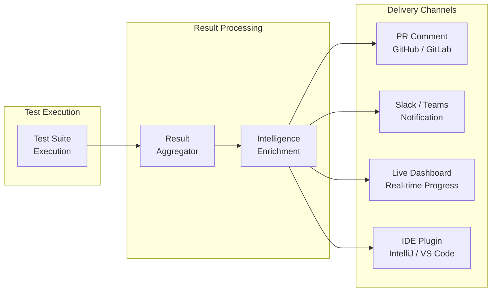

### 11.2 PR Comment Structure

```markdown
## 🧪 QE Platform — Test Results for PR #1234

### ✅ Summary: 47/48 tests passed (97.9%)

| Suite | Passed | Failed | Skipped | Duration |
|---|---|---|---|---|
| API Tests | 14/14 ✅ | 0 | 0 | 2m 15s |
| Contract Tests | 8/8 ✅ | 0 | 0 | 45s |
| UI E2E (impacted) | 25/26 ⚠️ | 1 | 2 (quarantined) | 12m 30s |

### ❌ Failures (1)
| Test | Error | Root Cause Hint | Owner |
|---|---|---|---|
| `checkout_with_new_address` | Address form validation timeout | 🔄 Possible flakiness (FI: 0.04) — consider retry | @checkout-team |

### 📊 Impact Analysis
- **Changed modules:** cart, checkout
- **Tests selected:** 48 / 340 total (85.9% reduction)
- **Cost:** $4.20 (budget: $15.00)

### 🔗 [Full Report](https://qe-dashboard.internal/runs/12345) | [Screenshots](https://artifacts.internal/pr-1234)
```

### 11.3 Slack/Teams Notification Tiers

| Event | Channel | Urgency | Format |
|---|---|---|---|
| PR tests all pass | Author DM | Low | ✅ emoji + one-liner |
| PR tests have failures | Author DM + team channel | Medium | Summary + failure links |
| Main branch regression | #qe-alerts | High | Full failure report + impact |
| SLO violation | #qe-alerts + on-call | Critical | Alert with playbook link |
| Flaky test quarantined | #qe-flaky | Low | Auto-quarantine notice |

### 11.4 How This Improves Development Velocity

1. **Sub-15-minute feedback** on PRs → developers stay in context, don't context-switch
2. **Root cause hints** → reduces debugging time from hours to minutes
3. **Impact analysis** → developers see exactly which tests cover their changes
4. **Quarantined flaky tests** → never blocked by tests unrelated to their change
5. **Cost transparency** → teams understand the cost of their test executions

---

## 🌍 12. ENVIRONMENT DRIFT DETECTION

### 12.1 Drift Detection Architecture

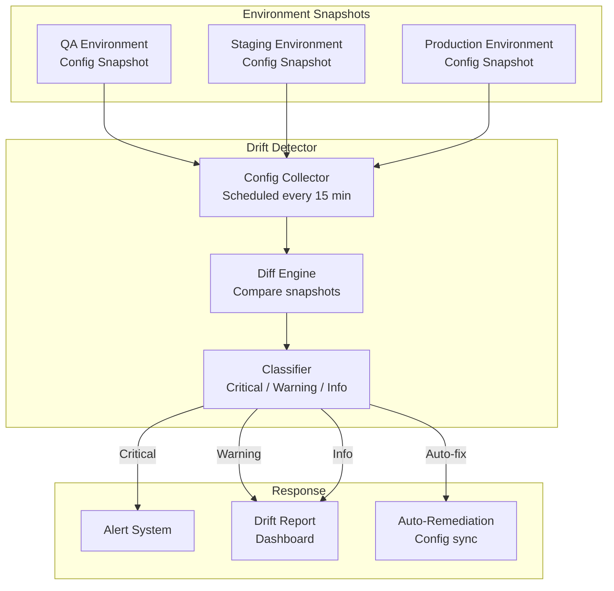

### 12.2 What Gets Monitored

| Drift Category | Check Method | Frequency | Severity |
|---|---|---|---|
| **Application Version** | API version endpoint comparison | Every deploy | 🔴 Critical if mismatch during testing |
| **Feature Flags** | Feature flag service API | Every 15 min | 🟠 High — causes test behavior divergence |
| **Database Schema** | Schema diff tool (Flyway/Liquibase state) | Every deploy | 🔴 Critical — breaks data-dependent tests |
| **Environment Variables** | Config comparison API | Every 15 min | 🟡 Medium |
| **Service Dependencies** | Health check all downstream services | Every 5 min | 🟠 High if service unavailable |
| **SSL/TLS Certificates** | Certificate expiry check | Daily | 🟡 Medium (warning 30 days before expiry) |
| **Resource Quotas** | K8s resource quota comparison | Hourly | 🟡 Medium |

### 12.3 How Drift Prevents False Failures

**Scenario:** Tests run against QA, but QA is 2 versions behind Staging. A test for a new feature fails — not because of a bug, but because the feature doesn't exist in QA yet.

**Detection:**
```
Drift Alert: QA application version (v2.3.1) ≠ Staging (v2.5.0)
Impact: 12 tests reference features introduced in v2.4.0+
Action: Skip affected tests on QA, run only on Staging
```

**Outcome:** Zero false failures. Tests automatically adapt to environment reality.

---

## 🧱 13. TEST DATA ENGINEERING SYSTEM

### 13.1 Architecture

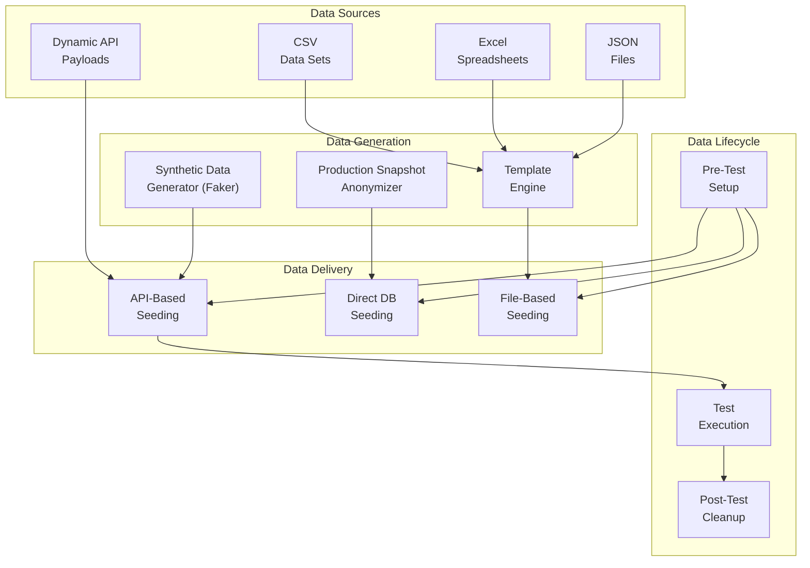

### 13.2 Data Strategy for AutomationExercise.com

| Test Scenario | Data Strategy | Setup Method | Cleanup Method |
|---|---|---|---|
| **User Registration** | Generate unique email per run (`test_<uuid>@test.com`) | API: `POST /api/createAccount` | API: `DELETE /api/deleteAccount` |
| **Login Tests** | Pre-seeded known-good test account | API setup before suite | No cleanup (persistent) |
| **Product Browsing** | Use existing product catalog (read-only) | None needed | None needed |
| **Cart Operations** | Add products via API before UI test | API: `POST /add_to_cart` | Clear cart via API |
| **Checkout Flow** | Create user + populate cart via API | API chain: create account → add products | Delete account post-test |
| **Search Tests** | Use known product names from catalog | None needed | None needed |
| **Contact Form** | Generate synthetic message + test file | File generation in setup | None needed |

### 13.3 Dynamic Payload Generation

```
UserPayload.generate():
  name: Faker.name()
  email: "qe_test_${UUID.random()}@testmail.com"
  password: "SecurePass123!"
  title: random(["Mr", "Mrs", "Miss"])
  birth_date: random(1-28)
  birth_month: random(1-12)
  birth_year: random(1970-2000)
  firstname: Faker.firstName()
  lastname: Faker.lastName()
  company: Faker.company()
  address1: Faker.streetAddress()
  address2: Faker.secondaryAddress()
  country: random(["India", "United States", "Canada", "Australia"])
  zipcode: Faker.zipCode()
  state: Faker.state()
  city: Faker.city()
  mobile_number: Faker.phoneNumber()
```

### 13.4 Environment-Independent Data Strategy

- **No hardcoded data** — all test data generated or seeded per execution
- **Unique identifiers** — UUID-based emails/names prevent collision across parallel runs
- **Idempotent setup** — data seeding is safe to retry (create-if-not-exists pattern)
- **Self-cleaning** — every test that creates data has a corresponding cleanup step in `@AfterMethod` / finally block

### 13.5 Data Privacy & Compliance

#### 13.5.1 Data Handling Policy

| Data Category | Policy | Implementation |
|---|---|---|
| **Production Data Snapshots** | Anonymized before use in test environments | Faker library replaces PII: names, emails, addresses, phone numbers |
| **Test-Generated PII** | Synthetic only — no real user data | UUID-based emails (`qe_test_<uuid>@testmail.com`), Faker-generated names |
| **Test Execution Logs** | May contain request/response payloads with test PII | Auto-purged after 30 days; masked in long-term analytics |
| **Screenshots/Videos** | May capture UI with test user data | Auto-deleted after 7 days (videos) / 30 days (screenshots) |
| **Database Snapshots** | Anonymized copy of production schema + data | AES-256 encrypted at rest; access restricted to QE Platform team |

#### 13.5.2 Encryption Standards

| Layer | Standard | Implementation |
|---|---|---|
| **Data at Rest** | AES-256 | Cloud provider managed encryption (GKE persistent volumes, Cloud Storage) |
| **Data in Transit** | TLS 1.3 | All inter-service communication via mTLS; test runner ↔ grid encrypted |
| **Secrets Management** | HashiCorp Vault / K8s Secrets | Test credentials never in code; injected via environment variables |
| **Log Redaction** | Regex-based PII masking | Passwords, tokens, credit card numbers auto-redacted in ELK |

#### 13.5.3 Data Retention Policy

| Data Type | Retention Period | Deletion Method | Compliance |
|---|---|---|---|
| Test execution metadata | 365 days | Automated TimescaleDB retention policy | Analytics + intelligence |
| Test reports (HTML/JSON) | 90 days | S3 lifecycle policy | Historical analysis |
| Failure screenshots | 30 days | S3 lifecycle policy | Debug support |
| Video recordings | 7 days | S3 lifecycle policy | Flaky test reproduction |
| Raw test logs (ELK) | 30 days | Elasticsearch ILM policy | Root cause analysis |
| Anonymized production data | 90 days per refresh cycle | Automated replacement | Test data freshness |

#### 13.5.4 Access Control for Test Data

| Role | Access Level | Justification |
|---|---|---|
| **QE Platform Engineers** | Full access to all test data + infrastructure | Platform operation and debugging |
| **QE Test Authors (Squad)** | Read access to own team's test results + logs | Test maintenance and debugging |
| **Developers** | Read access to PR test results only | Feedback on their changes |
| **Leadership** | Read access to dashboards + aggregated metrics | Executive visibility |
| **External Auditors** | Read access to compliance reports only | Audit trail verification |

#### 13.5.5 Compliance Framework

```
Compliance Policy:
  - Monthly automated audit: verify data retention policies enforced
  - Quarterly access review: validate role-based access is current
  - Annual penetration test: test the QE platform itself for vulnerabilities
  - Incident response SLA: notify affected parties within 24h of data breach
  - GDPR right-to-erasure: if test data references real users (production
    snapshots), deletion request honored within 72 hours
```

> [!WARNING]
> **Critical Rule:** Production database snapshots used for test data MUST be anonymized before leaving the production network boundary. Raw production data NEVER enters test environments. This is enforced by the data pipeline — the anonymization step is a mandatory, non-skippable stage.

---

## 🧪 14. FULL TEST COVERAGE STRATEGY

### 14.1 Comprehensive Coverage Map

#### Authentication Domain (42 tests)

| Sub-domain | Happy Path | Negative | Edge Case | Security |
|---|---|---|---|---|
| **User Registration** | Valid signup (UI + API) | Missing required fields, duplicate email | Max-length inputs, unicode characters | XSS in name, SQL injection in email |
| **Login** | Valid login (UI + API) | Wrong password, non-existent email | Case sensitivity, leading/trailing spaces | Brute force protection, session fixation |
| **Logout** | Successful logout | — | Multi-tab logout, back button after logout | Session invalidation verification |
| **Account Deletion** | Delete own account | Delete non-existent, wrong password | Re-register after deletion | Delete other user's account (IDOR) |
| **Account Update** | Update profile fields | Invalid data types, missing required | Concurrent updates | Update other user's profile |
| **Session Management** | Valid session persistence | Expired session handling | Multiple device sessions | Session token predictability |

#### Product Catalog Domain (35 tests)

| Sub-domain | Happy Path | Negative | Edge Case |
|---|---|---|---|
| **Product List** | View all products (API + UI) | Empty category | Pagination boundary |
| **Product Detail** | View product detail page | Non-existent product ID | Product with missing image |
| **Category Filter** | Filter by Women/Men/Kids | Invalid category ID | Rapid category switching |
| **Brand Filter** | Filter by brand (Polo, H&M, etc.) | Invalid brand name | Brand with zero products |
| **Product Search** | Search by valid keyword | Empty search, no results | Special characters, XSS probe |
| **Brand API** | GET all brands list | PUT to brands (405) | Concurrent brand requests |
| **Product API** | GET all products | POST to products (405) | Large response handling |

#### Cart System Domain (28 tests)

| Sub-domain | Happy Path | Negative | Edge Case |
|---|---|---|---|
| **Add to Cart** | Add single product | Add non-existent product | Add same product multiple times |
| **View Cart** | View cart with items | View empty cart | Cart with 50+ items |
| **Quantity Management** | Update quantity | Quantity = 0, negative quantity | Max quantity boundary |
| **Remove from Cart** | Remove item | Remove already-removed item | Remove all items one by one |
| **Cart Persistence** | Cart persists after navigation | Cart after logout/login | Cart across browser sessions |
| **Cart Calculation** | Total price accuracy | Floating point precision | Multi-currency edge case |

#### Checkout Flow Domain (22 tests)

| Sub-domain | Happy Path | Negative | Edge Case |
|---|---|---|---|
| **Address Entry** | Valid address submission | Missing required fields | Max-length address, unicode |
| **Payment (Mocked)** | Successful payment | Payment decline, timeout | Network interruption during payment |
| **Order Confirmation** | Order placed successfully | Double submission | Order with 1 item vs 20 items |
| **Guest Checkout** | Redirect to login | — | Add to cart → login → resume |

#### Search Functionality (12 tests)

| Test | Type | Expected |
|---|---|---|
| Search valid keyword "top" | Happy path | Returns matching products |
| Search valid keyword "tshirt" | Happy path | Returns T-shirt products |
| Search valid keyword "jean" | Happy path | Returns jeans products |
| Search empty string | Negative | Appropriate error/all products |
| Search special characters | Edge | No crash, sanitized response |
| Search no results keyword | Negative | "No products found" message |
| API search with parameter | API | 200 + matching products JSON |
| API search without parameter | API Negative | 400 + error message |
| Search result count validation | Integration | API count matches UI count |
| Search + add to cart flow | E2E | Search → select → add to cart |
| Search performance | Performance | Response < 2s for any query |
| Search XSS attempt | Security | Input sanitized, no execution |

#### Contact Forms (8 tests)
#### Subscription Flows (6 tests)
#### Cross-cutting Security (15 tests)
#### Performance-Sensitive Flows (10 tests)

**Total: ~178 automated tests across all domains**

---

## ⚠️ 15. FAULT TOLERANCE & SCALABILITY MODEL

### 15.1 Behavior Under 1000+ Parallel Executions

```
System capacity model:
- K8s cluster: 100 nodes × 16 vCPU = 1,600 vCPU total
- Per UI test pod: 2 vCPU + 2 GB RAM
- Per API test pod: 0.5 vCPU + 512 MB RAM
- Max UI parallel: 800 pods
- Max API parallel: 3,200 pods
- Hybrid (typical): 200 UI + 800 API = 1,000 parallel tests

Scaling strategy:
1. Cluster auto-scaler adds nodes when pod pressure detected
2. Node pools: spot/preemptible instances for cost (60% savings)
3. Burst capacity: cloud provider burst pools for release pipelines
```

### 15.2 Resilience Design Under Load Spikes

| Scenario | Detection | Response | Recovery |
|---|---|---|---|
| **Sudden 5x test volume** | Queue depth spike | Auto-scale runners, activate burst pool | Scale down after queue drains |
| **K8s node failure** | Node not-ready condition | Reschedule pods, re-enqueue tests | Replace node (cloud auto-repair) |
| **Selenium Grid saturation** | Session queue > 100 | Rate-limit new sessions, prioritize by pipeline importance | Scale grid nodes |
| **Database connection exhaustion** | Connection pool full | Connection pooling, retry with backoff | Alert DBA, increase pool size |
| **Network partition** | Test timeout spike | Reroute to different AZ, pause affected runners | Resume after network recovery |
| **Cascading failures** | Error rate > 50% across all runners | Circuit breaker: halt all non-critical tests | Gradual resume with canary test |

### 15.3 Test Prioritization Under Resource Contention

When resources are scarce (e.g., 3 release pipelines competing for 50 runner pods):

```
Priority Queue:
1. Production hotfix pipeline (P0) — gets 50% of resources guaranteed
2. Release candidate pipeline (P1) — gets 30% of resources
3. Feature branch pipelines (P2) — share remaining 20%
4. Nightly regression (P3) — preemptible, can be delayed

Within each priority level:
- Smoke tests run first (always)
- API tests before UI tests
- Impacted tests before full regression
- Revenue-critical paths before auxiliary features
```

---

## 📦 16. ENTERPRISE FOLDER STRUCTURE

```
automation_exercise/
├── README.md
├── pom.xml / build.gradle
├── Dockerfile
├── docker-compose.yml
├── Jenkinsfile / .github/workflows/
│
├── config/
│   ├── environments/
│   │   ├── qa.properties
│   │   ├── staging.properties
│   │   └── production.properties
│   ├── grid/
│   │   ├── selenium-grid-config.toml
│   │   └── browser-capabilities.json
│   ├── wiremock/
│   │   ├── mappings/
│   │   │   ├── payment-gateway-stub.json
│   │   │   ├── email-service-stub.json
│   │   │   └── captcha-stub.json
│   │   └── __files/
│   │       └── response-templates/
│   └── test-intelligence/
│       ├── flaky-detection-config.yml
│       ├── impact-analysis-mappings.yml
│       └── slo-definitions.yml
│
├── src/
│   ├── main/
│   │   └── java/com/qe/platform/
│   │       ├── core/
│   │       │   ├── config/
│   │       │   │   ├── EnvironmentConfig.java
│   │       │   │   ├── GridConfig.java
│   │       │   │   └── TestConfig.java
│   │       │   ├── driver/
│   │       │   │   ├── DriverFactory.java
│   │       │   │   ├── DriverManager.java
│   │       │   │   └── BrowserType.java
│   │       │   ├── reporting/
│   │       │   │   ├── ReportEngine.java
│   │       │   │   ├── AllureReportAdapter.java
│   │       │   │   └── MetricsPublisher.java
│   │       │   ├── retry/
│   │       │   │   ├── RetryAnalyzer.java
│   │       │   │   ├── RetryPolicy.java
│   │       │   │   └── QuarantineManager.java
│   │       │   └── logging/
│   │       │       ├── TestLogger.java
│   │       │       └── CorrelationIdProvider.java
│   │       │
│   │       ├── api/
│   │       │   ├── client/
│   │       │   │   ├── ApiCoreClient.java
│   │       │   │   ├── ProductApiClient.java
│   │       │   │   ├── BrandApiClient.java
│   │       │   │   ├── AuthApiClient.java
│   │       │   │   ├── AccountApiClient.java
│   │       │   │   └── SearchApiClient.java
│   │       │   ├── models/
│   │       │   │   ├── ProductResponse.java
│   │       │   │   ├── BrandResponse.java
│   │       │   │   ├── UserPayload.java
│   │       │   │   ├── LoginPayload.java
│   │       │   │   └── SearchPayload.java
│   │       │   └── validators/
│   │       │       ├── SchemaValidator.java
│   │       │       └── ContractValidator.java
│   │       │
│   │       ├── ui/
│   │       │   ├── pages/
│   │       │   │   ├── BasePage.java
│   │       │   │   ├── HomePage.java
│   │       │   │   ├── LoginPage.java
│   │       │   │   ├── SignupPage.java
│   │       │   │   ├── ProductsPage.java
│   │       │   │   ├── ProductDetailPage.java
│   │       │   │   ├── CartPage.java
│   │       │   │   ├── CheckoutPage.java
│   │       │   │   ├── PaymentPage.java
│   │       │   │   ├── ContactUsPage.java
│   │       │   │   └── AccountPage.java
│   │       │   ├── components/
│   │       │   │   ├── HeaderComponent.java
│   │       │   │   ├── FooterComponent.java
│   │       │   │   ├── CartModalComponent.java
│   │       │   │   ├── CategorySidebarComponent.java
│   │       │   │   ├── BrandSidebarComponent.java
│   │       │   │   ├── ProductCardComponent.java
│   │       │   │   └── SubscriptionComponent.java
│   │       │   └── flows/
│   │       │       ├── LoginFlow.java
│   │       │       ├── RegistrationFlow.java
│   │       │       ├── PurchaseFlow.java
│   │       │       └── SearchFlow.java
│   │       │
│   │       ├── data/
│   │       │   ├── generators/
│   │       │   │   ├── UserDataGenerator.java
│   │       │   │   ├── ProductDataGenerator.java
│   │       │   │   └── AddressDataGenerator.java
│   │       │   ├── providers/
│   │       │   │   ├── JsonDataProvider.java
│   │       │   │   ├── ExcelDataProvider.java
│   │       │   │   └── CsvDataProvider.java
│   │       │   ├── seeders/
│   │       │   │   ├── ApiDataSeeder.java
│   │       │   │   ├── DatabaseSeeder.java
│   │       │   │   └── TestDataLifecycleManager.java
│   │       │   └── cleanup/
│   │       │       └── DataCleanupService.java
│   │       │
│   │       ├── security/
│   │       │   ├── scanners/
│   │       │   │   ├── XssScanner.java
│   │       │   │   ├── SqlInjectionScanner.java
│   │       │   │   └── CsrfValidator.java
│   │       │   └── rbac/
│   │       │       ├── PermissionMatrixValidator.java
│   │       │       └── RoleTestHelper.java
│   │       │
│   │       ├── intelligence/
│   │       │   ├── FlakyDetectionEngine.java
│   │       │   ├── FailureClusterAnalyzer.java
│   │       │   ├── RootCauseCategorizer.java
│   │       │   ├── TestHealthScorer.java
│   │       │   └── ImpactAnalysisEngine.java
│   │       │
│   │       ├── orchestration/
│   │       │   ├── TestOrchestrator.java
│   │       │   ├── CostOptimizer.java
│   │       │   ├── PriorityCalculator.java
│   │       │   └── ExecutionPlanBuilder.java
│   │       │
│   │       ├── observability/
│   │       │   ├── MetricsCollector.java
│   │       │   ├── PrometheusExporter.java
│   │       │   ├── TracingInterceptor.java
│   │       │   └── SloMonitor.java
│   │       │
│   │       └── drift/
│   │           ├── EnvironmentSnapshotCollector.java
│   │           ├── DriftDetector.java
│   │           └── ConfigDiffEngine.java
│   │
│   └── test/
│       └── java/com/qe/platform/
│           ├── api/
│           │   ├── products/
│           │   │   ├── GetAllProductsTest.java
│           │   │   ├── PostToProductsListTest.java
│           │   │   └── ProductSchemaContractTest.java
│           │   ├── brands/
│           │   │   ├── GetAllBrandsTest.java
│           │   │   ├── PutToBrandsListTest.java
│           │   │   └── BrandSchemaContractTest.java
│           │   ├── search/
│           │   │   ├── SearchProductTest.java
│           │   │   ├── SearchWithoutParameterTest.java
│           │   │   └── SearchEdgeCaseTest.java
│           │   ├── auth/
│           │   │   ├── VerifyLoginValidTest.java
│           │   │   ├── VerifyLoginInvalidTest.java
│           │   │   ├── VerifyLoginMissingParamsTest.java
│           │   │   └── DeleteVerifyLoginTest.java
│           │   └── account/
│           │       ├── CreateAccountTest.java
│           │       ├── DeleteAccountTest.java
│           │       ├── UpdateAccountTest.java
│           │       └── GetUserDetailTest.java
│           │
│           ├── ui/
│           │   ├── auth/
│           │   │   ├── LoginTest.java
│           │   │   ├── SignupTest.java
│           │   │   ├── LogoutTest.java
│           │   │   └── AccountDeletionTest.java
│           │   ├── products/
│           │   │   ├── ProductCatalogTest.java
│           │   │   ├── ProductDetailTest.java
│           │   │   ├── CategoryFilterTest.java
│           │   │   ├── BrandFilterTest.java
│           │   │   └── ProductSearchTest.java
│           │   ├── cart/
│           │   │   ├── AddToCartTest.java
│           │   │   ├── ViewCartTest.java
│           │   │   ├── CartQuantityTest.java
│           │   │   └── RemoveFromCartTest.java
│           │   ├── checkout/
│           │   │   ├── CheckoutFlowTest.java
│           │   │   ├── PaymentTest.java
│           │   │   └── OrderConfirmationTest.java
│           │   ├── navigation/
│           │   │   ├── HeaderNavigationTest.java
│           │   │   ├── FooterNavigationTest.java
│           │   │   └── BreadcrumbTest.java
│           │   └── forms/
│           │       ├── ContactUsTest.java
│           │       └── SubscriptionTest.java
│           │
│           ├── integration/
│           │   ├── EndToEndPurchaseTest.java
│           │   ├── RegistrationToCheckoutTest.java
│           │   ├── SearchToCartTest.java
│           │   └── ApiUiConsistencyTest.java
│           │
│           ├── security/
│           │   ├── AuthenticationSecurityTest.java
│           │   ├── AuthorizationRbacTest.java
│           │   ├── InputValidationSecurityTest.java
│           │   ├── SessionManagementTest.java
│           │   └── ApiSecurityTest.java
│           │
│           ├── contract/
│           │   ├── ProductApiContractTest.java
│           │   ├── BrandApiContractTest.java
│           │   ├── AuthApiContractTest.java
│           │   └── AccountApiContractTest.java
│           │
│           └── performance/
│               ├── ApiResponseTimeTest.java
│               ├── PageLoadPerformanceTest.java
│               └── ConcurrentUserSimulationTest.java
│
├── test-data/
│   ├── json/
│   │   ├── valid-users.json
│   │   ├── invalid-users.json
│   │   └── search-keywords.json
│   ├── excel/
│   │   └── test-data-matrix.xlsx
│   ├── csv/
│   │   └── product-validation-data.csv
│   └── schemas/
│       ├── products-response-schema.json
│       ├── brands-response-schema.json
│       └── user-detail-response-schema.json
│
├── infrastructure/
│   ├── kubernetes/
│   │   ├── namespaces.yml
│   │   ├── runner-deployment.yml
│   │   ├── runner-hpa.yml
│   │   ├── selenium-grid-deployment.yml
│   │   ├── redis-deployment.yml
│   │   └── monitoring-stack.yml
│   ├── docker/
│   │   ├── Dockerfile.runner
│   │   ├── Dockerfile.api-runner
│   │   └── docker-compose.local.yml
│   └── terraform/
│       ├── main.tf
│       ├── variables.tf
│       └── modules/
│           ├── k8s-cluster/
│           ├── monitoring/
│           └── storage/
│
├── observability/
│   ├── prometheus/
│   │   ├── prometheus.yml
│   │   └── alert-rules.yml
│   ├── grafana/
│   │   ├── dashboards/
│   │   │   ├── executive-overview.json
│   │   │   ├── pipeline-health.json
│   │   │   ├── test-intelligence.json
│   │   │   ├── infrastructure.json
│   │   │   └── realtime-execution.json
│   │   └── provisioning/
│   │       └── datasources.yml
│   └── elk/
│       ├── logstash.conf
│       ├── elasticsearch-mappings.json
│       └── kibana-dashboards.ndjson
│
├── ci-cd/
│   ├── github-actions/
│   │   ├── pr-pipeline.yml
│   │   ├── main-pipeline.yml
│   │   ├── release-pipeline.yml
│   │   └── nightly-regression.yml
│   ├── jenkins/
│   │   ├── Jenkinsfile.pr
│   │   ├── Jenkinsfile.release
│   │   └── shared-libraries/
│   └── scripts/
│       ├── impact-analysis.sh
│       ├── test-selection.sh
│       ├── cost-report.sh
│       └── drift-check.sh
│
└── docs/
    ├── architecture/
    │   ├── system-architecture.md
    │   ├── control-plane-design.md
    │   ├── data-plane-design.md
    │   └── diagrams/
    ├── runbooks/
    │   ├── slo-violation-playbook.md
    │   ├── flaky-test-triage.md
    │   ├── infrastructure-scaling.md
    │   └── incident-response.md
    ├── onboarding/
    │   ├── getting-started.md
    │   ├── writing-tests.md
    │   └── local-development.md
    └── adr/ (Architecture Decision Records)
        ├── 001-control-data-plane-separation.md
        ├── 002-cost-optimization-strategy.md
        ├── 003-flaky-test-policy.md
        └── 004-slo-definitions.md
```

---

## 🎨 17. DESIGN PATTERNS MAPPING

| Pattern | Application | Component |
|---|---|---|
| **Page Object Model** | UI test abstraction — encapsulate page interactions | `ui/pages/*` |
| **Component Object** | Reusable UI components (header, footer, sidebar) | `ui/components/*` |
| **Flow Pattern** | Multi-page business workflows (login → browse → checkout) | `ui/flows/*` |
| **Builder Pattern** | Test data construction with fluent API | `data/generators/*` |
| **Factory Pattern** | WebDriver creation based on config | `core/driver/DriverFactory` |
| **Strategy Pattern** | Retry policies, test selection algorithms | `core/retry/*`, `orchestration/*` |
| **Observer Pattern** | Event-driven test result publishing | `core/reporting/MetricsPublisher` |
| **Circuit Breaker** | Prevent cascading failures in grid | `orchestration/TestOrchestrator` |
| **Decorator Pattern** | Enrich test execution with tracing, metrics | `observability/TracingInterceptor` |
| **Chain of Responsibility** | Failure classification pipeline | `intelligence/RootCauseCategorizer` |
| **Repository Pattern** | Test data access abstraction | `data/providers/*` |
| **Template Method** | Base test lifecycle (setup → execute → teardown → report) | `core/BaseTest` |
| **Singleton** | Configuration manager, driver manager | `core/config/*` |
| **Adapter Pattern** | Multiple reporting backends (Allure, custom) | `core/reporting/*` |

---

## 🏆 18. WHAT MAKES THIS STAFF/PRINCIPAL LEVEL

| Dimension | Junior/Mid QA Automation | **This Platform (Staff/Principal)** |
|---|---|---|
| **Scope** | Test scripts for one application | Global test infrastructure serving 100+ teams |
| **Architecture** | Flat test project | Control Plane / Data Plane separation with distributed systems |
| **Cost** | Not considered | Cost-per-test tracking, budget enforcement, optimization engine |
| **Intelligence** | None | ML-based flaky detection, failure clustering, predictive test selection |
| **Scalability** | 10 parallel tests | 1000+ parallel on K8s with auto-scaling and spot instances |
| **Reliability** | Tests either pass or fail | SLOs/SLAs, burn rate alerts, incident response playbooks |
| **Impact Analysis** | Run everything every time | Dependency graph + historical correlation → 80%+ test reduction |
| **Observability** | Test report HTML file | Prometheus + Grafana + ELK + distributed tracing + alerting |
| **Feedback** | "Tests failed" email | Rich PR comments with root cause hints, cost transparency, impact analysis |
| **Environment** | Hardcoded URLs | Drift detection, config comparison, automatic environment-aware test routing |
| **Data** | Hardcoded test data | Synthetic generation, API seeding, lifecycle management, self-cleaning |
| **Security** | Not tested | RBAC validation, injection testing, permission matrix, negative security |
| **Service Isolation** | Tests hit real APIs | Full service virtualization with WireMock/MockServer |
| **Resilience** | Test fails → pipeline fails | Retry policies, quarantine system, circuit breakers, failure-aware rerouting |
| **Decision Making** | Human decides what to run | System intelligently selects, prioritizes, and optimizes test execution |

> [!IMPORTANT]
> The fundamental difference: a Senior QA builds test automation. A **Staff/Principal QE Architect** builds the **platform that enables test automation at scale** — with intelligence, cost awareness, self-healing, and operational excellence built into every layer.

---

## 🔧 19. TECHNOLOGY STACK DECISIONS

### 19.1 Technology Justification Matrix

| Category | **Selected** | Alternatives Considered | Rationale |
|---|---|---|---|
| **Primary Language** | **Java 17+** | Python, Kotlin, TypeScript | Matches existing SauceDemo framework expertise; strongest ecosystem for test tooling (Selenium, RestAssured, TestNG); enterprise adoption at all FAANG companies; type safety prevents runtime errors in test infrastructure code |
| **Intelligence/ML** | **Python 3.11+** (secondary) | Java ML libraries, R | Python dominates ML ecosystem (scikit-learn, pandas, numpy); flaky detection statistical models are 10x faster to prototype in Python; isolated microservice communicates via gRPC/REST — no coupling to Java test code |
| **Orchestrator** | **Java-based custom** (Spring Boot) | Apache Airflow, Go, Temporal | Spring Boot provides robust REST API framework; keeps orchestrator in same language as test framework (shared models); Airflow is overkill for test orchestration (designed for data pipelines); custom gives full control over scheduling logic |
| **Test Framework** | **TestNG 7.x** | JUnit 5 | TestNG's `@DataProvider` is superior for data-driven testing (AutomationExercise has 14 API endpoints × multiple parameter combinations); built-in parallel execution at suite/class/method level; `IRetryAnalyzer` interface enables custom retry logic; `@Listeners` for event-driven reporting; XML suite configuration for flexible execution grouping |
| **API Client** | **RestAssured 5.x** | OkHttp + custom, Retrofit, Apache HttpClient | Fluent BDD-style syntax (given/when/then) makes API tests readable; built-in JSON/XML validation; seamless integration with TestNG; schema validation via JSON Schema; industry standard for Java API testing |
| **UI Framework** | **Selenium 4 (W3C WebDriver)** | Playwright, Cypress | W3C standard ensures cross-browser compatibility (Chrome, Firefox, Edge, Safari); Selenium Grid 4 provides distributed execution out-of-box; Java bindings are mature; largest ecosystem of tools/libraries; Playwright lacks Java-first support; Cypress cannot test cross-origin and has limited browser support |
| **Build Tool** | **Maven 3.9+** | Gradle | Maven's convention-over-configuration reduces decision fatigue; better IDE integration (IntelliJ); more predictable dependency resolution; industry standard for Java enterprise projects |
| **Reporting** | **Allure 2.x** | ExtentReports, custom | Rich HTML reports with history trends; TestNG integration via `allure-testng`; screenshot/video attachment support; CI/CD plugin ecosystem (Jenkins, GitHub Actions); open-source |
| **Containerization** | **Docker + K8s (GKE)** | ECS, bare metal | Kubernetes is the industry standard for container orchestration; GKE provides managed control plane; HPA for auto-scaling; native support for Selenium Grid 4 |
| **CI/CD** | **GitHub Actions** (primary) + **Jenkins** (fallback) | GitLab CI, CircleCI, Spinnaker | GitHub Actions: native GitHub integration, matrix builds, reusable workflows, free tier for open-source; Jenkins: enterprise fallback for complex pipeline orchestration, shared libraries |
| **Service Virtualization** | **WireMock 3.x** | MockServer, Mountebank | Standalone mode + JUnit integration; JSON-based stub configuration; record-and-playback mode; stateful scenarios; Docker support |
| **Contract Testing** | **Pact JVM 4.x** | Spring Cloud Contract | Consumer-driven approach (see §4.5); JVM-native; Pact Broker for contract sharing; provider verification built into Maven lifecycle |

### 19.2 Polyglot Architecture Boundaries

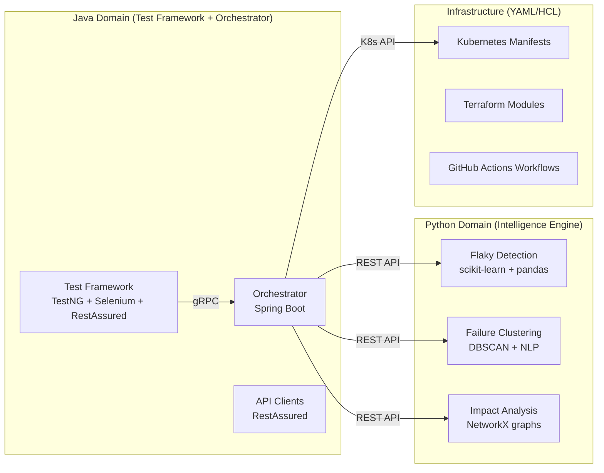

### 19.3 Migration Path (Tool Swap Without Rewrite)

> [!TIP]
> **Design for replaceability.** Every external tool is wrapped behind an interface. Swapping Selenium for Playwright requires implementing one interface — not rewriting 1,000 tests.

| Component | Interface Boundary | Swap Effort |
|---|---|---|
| **Browser Driver** | `DriverFactory` → returns `WebDriver` interface | Implement new factory method; Page Objects unchanged |
| **API Client** | `ApiCoreClient` wraps RestAssured | Implement new client behind same interface; tests unchanged |
| **Reporting** | `ReportEngine` interface with `AllureReportAdapter` | Implement `ExtentReportAdapter`; tests unchanged |
| **CI/CD** | Pipeline YAML files only — no framework coupling | Rewrite YAML files; test code unchanged |
| **Service Virtualization** | `MockServiceManager` interface | Swap WireMock → MockServer behind interface |
| **Test Framework** | Most risk — TestNG annotations are pervasive | Use annotation processor for migration; 2-4 week effort |

---

## 📅 20. PHASED IMPLEMENTATION ROADMAP

### Phase 0: MVP Foundation (Weeks 1-4)

**Goal:** Prove the approach works. Get 40 smoke tests running on every PR.

| Deliverable | Details | Success Metric |
|---|---|---|
| **Project scaffolding** | Maven multi-module project, folder structure (§16) | Compiles and runs locally |
| **Core framework** | BasePage, BaseTest, DriverFactory, EnvironmentConfig | Framework initializes cleanly |
| **Page Objects (6 pages)** | HomePage, LoginPage, SignupPage, ProductsPage, CartPage, ContactUsPage | All pages instantiate correctly |
| **API Client** | ApiCoreClient + 4 domain clients (Product, Auth, Search, Account) | All 14 API endpoints callable |
| **40 Smoke Tests** | Auth (8), Products (8), Cart (6), Checkout (4), Search (6), Contact (4), API Health (4) | All 40 green on local Chrome |
| **GitHub Actions pipeline** | Sequential: build → API tests → UI tests (Chrome only) | PR pipeline completes < 10 min |
| **Allure reporting** | HTML report generated, attached as GitHub Actions artifact | Reports viewable after each run |
| **Test data generation** | UserDataGenerator with Faker, UUID-based unique emails | Zero test data conflicts in parallel |

```
Phase 0 Cost: $0 infrastructure (runs on GitHub Actions free tier)
Team: 2 FTE (1 framework engineer + 1 QE test author)
Risk: Low — proven technology stack, no infrastructure complexity
```

### Phase 8: Final Stabilization
1. Execute full suite and ensure 100% pass rate.
2. Resolve any remaining flakes related to timeouts or Chrome headless CDP mismatches.

### Phase 9: Comprehensive Negative & Edge Case Coverage (Completed)
**Goal:** Expand UI coverage beyond the official 26 happy-path test cases to achieve exhaustive coverage by automating all possible negative, boundary, and unhappy path scenarios.

### Phase 10: Massive UI Exhaustive Coverage (Current)
**Goal:** Dramatically scale the test suite to include boundary value analysis, extreme edge cases, format validations, and basic security/injection tests across all features, pushing the test suite towards 100+ executed scenarios.

## User Review Required

> [!CAUTION]  
> Executing this sheer volume of advanced negative tests will significantly increase the test execution time. Please review the exhaustive categories below. If you approve, I will begin implementing these scenarios in dedicated `Exhaustive...Tests.java` classes.

## Proposed Changes

### 1. Exhaustive Authentication (`ExhaustiveAuthTests.java`)
#### [NEW] `qe-ui/src/test/java/com/automationexercise/qe/ui/tests/exhaustive/ExhaustiveAuthTests.java`
- **Boundary Tests:** Register with extremely long names (e.g., 500 characters) and extremely long passwords.
- **Format Validation:** Register using emails with leading/trailing spaces, missing `@`, or missing domains.
- **Special Characters:** Register with names containing emojis, Arabic, Chinese, and special symbols.
- **Injection:** Attempt login with SQL injection payloads in the email field (`admin' --`).
- **Partial Data:** Attempt to login by filling only the password field (empty email) and vice versa.

### 2. Exhaustive Product & Cart (`ExhaustiveCartTests.java`)
#### [NEW] `qe-ui/src/test/java/com/automationexercise/qe/ui/tests/exhaustive/ExhaustiveCartTests.java`
- **Zero/Negative Quantity:** Attempt to add `0` items and `-5` items to the cart.
- **Max Quantity Limits:** Attempt to add `999,999,999` items to the cart and verify application stability.
- **Non-Numeric Quantity:** Inject non-numeric characters (`abc`, `$$$`) into the quantity field before adding to cart.
- **Review Form Exhaustion:** Submit product reviews with empty text, empty name, and extremely long review bodies.

### 3. Exhaustive Forms & Uploads (`ExhaustiveFormTests.java`)
#### [NEW] `qe-ui/src/test/java/com/automationexercise/qe/ui/tests/exhaustive/ExhaustiveFormTests.java`
- **Contact Us File Uploads:** 
  - Attempt to upload an invalid file extension (e.g., `.exe`, `.bat`).
  - Attempt to upload an empty file (0 bytes).
- **Contact Us Boundaries:** Submit messages that exceed standard varchar limits (e.g., 10,000+ characters).
- **Search Chaos:** Search using complex regex strings, emojis, and XSS payloads (``).

## Verification Plan
- Create the new `exhaustive` test package.
- Implement the test logic using Data Providers where appropriate to run multiple malicious/edge-case payloads efficiently.
- Execute `mvn test -pl qe-ui -Denv=qa` to verify the application's behavior against extreme edge cases and document any new vulnerabilities discovered. Make the system smart about what it runs.

| Deliverable | Details | Success Metric |
|---|---|---|
| **Expand to 120 tests** | Edge cases, negative scenarios, security basics, contract tests | Full domain coverage started |
| **Flaky detection engine** | FI calculation (§7.2), 30-day sliding window, daily recalculation | Flaky tests identified within 24h |
| **Test Impact Analysis** | File → module → test dependency graph (§4.2), `impact-analysis.sh` script | 80% fewer tests on auth-only changes |
| **Quarantine system** | Auto-quarantine at FI ≥ 0.05, GitHub Issue auto-creation | Zero PR blocks from flaky tests |
| **Cost tracking** | Per-test cost calculation, pipeline cost summary in PR comments | Cost visible per pipeline |
| **Docker Compose local** | 10-15 tests concurrent via Docker Compose with Selenium Grid | Local parallel execution works |
| **Prometheus basic** | Export: test_count, test_duration, pass_rate, flaky_count | Metrics visible in Prometheus |
| **PR feedback** | GitHub PR comments with test results, impact analysis, cost | Developers get feedback < 15 min |

```
Phase 1 Cost: ~$500/month (Docker, Allure Cloud)
Team: 3 FTE (1 framework + 1 intelligence + 1 QE author)
Risk: Medium — intelligence engine requires historical data accumulation
```

### Phase 2: Distributed Scale (Weeks 13-24)

**Goal:** Move to cloud-native execution. Support 1000+ parallel tests.

| Deliverable | Details | Success Metric |
|---|---|---|
| **200+ tests** | Performance, integration, full contract suite, advanced security | All domains at ≥ 80% coverage |
| **GKE cluster** | 5-10 node dev cluster, namespaces per §8.1 | K8s cluster operational |
| **Selenium Grid 4** | Chrome + Firefox + Edge node pools, HPA 2-50 pods | 3 browser types available |
| **Auto-scaling runners** | HPA configuration per §8.2, burst scaling | Scale from 5 → 50 pods in < 5 min |
| **Multi-environment** | QA + Staging support, environment-aware config | Tests run against both environments |
| **Grafana dashboards** | 5 dashboards: Executive, Pipeline, Intelligence, Infra, Real-time | All dashboards functional |
| **Service virtualization** | WireMock stubs for payment, CAPTCHA, email | External dependencies isolated |
| **SLO monitoring** | SLO definitions deployed, burn rate alerts configured | SLO violations detected < 5 min |
| **Load testing baseline** | Gatling load test for platform, baseline metrics established | Platform handles 1000 parallel tests |

```
Phase 2 Cost: ~$2,500/month (GKE + monitoring + storage)
Team: 5 FTE (2 framework + 1 infra/DevOps + 1 intelligence + 1 QE author)
Risk: High — K8s operational complexity, Grid stability at scale
```

### Phase 3: Enterprise Hardening (Months 6-12)

**Goal:** Production-grade platform. Self-healing, cost-optimized, FAANG-ready.

| Deliverable | Details | Success Metric |
|---|---|---|
| **340+ full test suite** | All domains mature, edge cases, negative, security | 100% domain coverage |
| **ML failure prediction** | Python intelligence service, root cause categorization | 70% accurate root cause prediction |
| **Environment drift detection** | Config snapshot comparison, auto-skip on drift | Zero false failures from drift |
| **Advanced RBAC testing** | Full permission matrix (§6.3), IDOR testing, session management | Security test coverage complete |
| **Multi-region execution** | Runner pools in 2+ cloud regions | Failover works < 5 min |
| **ELK logging** | Elasticsearch + Logstash + Kibana for test logs | Full log search across all executions |
| **Distributed tracing** | Jaeger traces for test execution lifecycle | End-to-end trace visibility |
| **Kill switch** | Emergency bypass protocol (§10.6) tested and documented | DR drill completed |
| **Data privacy compliance** | Encryption, retention, access control (§13.5) | Compliance audit passed |
| **Team governance** | On-call rotation, runbooks, ADRs, office hours | Fully operational QE platform team |

```
Phase 3 Cost: ~$5,000/month (multi-region GKE + full observability)
Team: 6-8 FTE (full QE Platform team per §21)
Risk: Medium — operational maturity required, organizational buy-in
```

### Phase Timeline Visualization

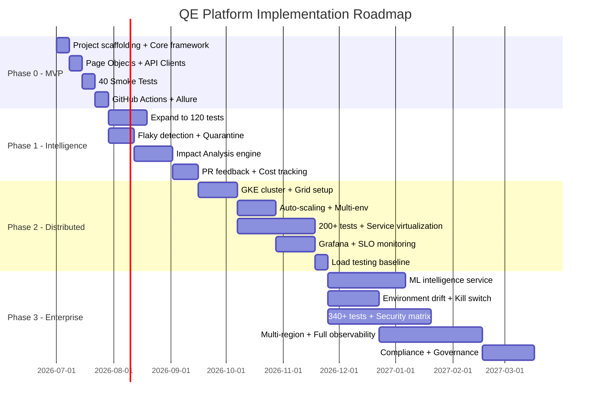

---

## 👥 21. TEAM STRUCTURE & GOVERNANCE

### 21.1 Team Structure

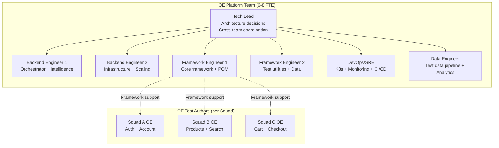

### 21.2 Responsibility Matrix (RACI)

| Activity | Platform Tech Lead | Platform Engineers | Squad QEs | SRE | Management |
|---|---|---|---|---|---|
| Architecture decisions | **A** (Accountable) | **C** (Consulted) | I | C | I |
| Framework development | C | **R** (Responsible) | I | I | I |
| Test authoring | I | C | **R** | I | I |
| Quarantined test fix | I | **C** | **R** | I | I |
| Infrastructure ops | C | I | I | **R** | I |
| SLO monitoring | **A** | R | I | R | I |
| Incident response (P1) | **A** | R | I | **R** | I |
| Cost reporting | R | I | I | I | **A** |

### 21.3 On-Call Rotation

| Rotation | Coverage | Team | Response SLA |
|---|---|---|---|
| **Primary On-Call** | 24/7, 1-week rotation | QE Platform Engineers (4 people) | P1: 15 min, P2: 1 hour |
| **Secondary On-Call** | Business hours escalation | QE Tech Lead | P1 escalation: 30 min |
| **SRE On-Call** | Infrastructure issues only | Shared with SRE team | P1: 15 min |

**Severity Definitions:**

| Severity | Definition | Examples |
|---|---|---|
| **P1** | Platform completely down, no tests can execute | K8s cluster down, Grid unresponsive, all pipelines failing |
| **P2** | Platform degraded, SLO breach | Smoke > 15 min, reliability < 98%, Grid at 95% capacity |
| **P3** | Non-blocking issue | Flaky rate > 2%, Grafana dashboard down, slow Allure reports |
| **P4** | Improvement opportunity | Feature request, optimization, documentation gap |

### 21.4 Change Management

| Change Type | Process | Lead Time | Testing |
|---|---|---|---|
| **Framework breaking change** | 2-week deprecation notice + migration guide + office hours | 2 weeks | Run on nightly regression first |
| **New API client/utility** | PR review by Tech Lead + 1 Platform Engineer | 1-3 days | Unit tests + integration test |
| **CI/CD pipeline change** | Test on non-critical pipeline (nightly) first | 1 week | Shadow run before activation |
| **K8s config change** | SRE review + load test validation | 1 week | Load test in staging cluster |
| **Dependency version bump** | Automated Dependabot PR + full regression | 1-3 days | Full regression must pass |
| **SLO threshold change** | Tech Lead + QE Lead approval, documented in ADR | 1 week | Monitor for 2 weeks post-change |

### 21.5 Knowledge Transfer & Communication

| Mechanism | Frequency | Audience | Content |
|---|---|---|---|
| **Architecture Decision Records (ADRs)** | Per decision | All engineers | Why we chose X over Y |
| **Platform Office Hours** | Weekly (30 min) | All QE authors | Q&A, new features, best practices |
| **Quarterly Tech Talk** | Quarterly (1 hour) | Engineering org | Platform updates, metrics, roadmap |
| **Runbooks** | Updated per incident | On-call engineers | Step-by-step troubleshooting |
| **Onboarding Guide** | Updated quarterly | New team members | Getting started, writing tests, local setup |
| **Weekly Platform Metrics Email** | Weekly | QE Lead + Management | Pass rate, cost, SLO status, flaky count |
| **Blameless Postmortems** | Per P1/P2 incident | All involved parties | Root cause, timeline, action items |

---

## 🎯 NEXT STEPS — Decision Points

The following decisions are required before implementation begins:

> [!IMPORTANT]
> **1. Phase Selection:** Which phase aligns with your timeline and budget? Phase 0 (4 weeks, $0 infra) is the recommended starting point to validate the approach.

> [!IMPORTANT]
> **2. Team Allocation:** How many FTEs can you dedicate? Phase 0 needs 2, Phase 1 needs 3, Phase 2 needs 5, Phase 3 needs 6-8.

> [!IMPORTANT]
> **3. Cloud Provider:** GKE (recommended for managed K8s), EKS, or AKS? This affects Phase 2+ infrastructure costs.

> [!IMPORTANT]
> **4. Compliance Requirements:** What regulations apply to your testing data? (GDPR/CCPA/HIPAA?) This determines §13.5 implementation urgency.

> [!IMPORTANT]
> **5. On-Call Readiness:** Who leads the QE Platform team? Is there an existing on-call culture? This determines §21 implementation.

> [!IMPORTANT]
> **6. Bypass Authority:** Who has authority to approve emergency bypass (§10.6)? What's the acceptable risk threshold for shipping without tests?

---

## Verification Plan

### Automated Tests
- Each layer validated independently through unit + integration tests
- CI pipeline validates test suite health on every commit
- SLO compliance validated through Prometheus alerting rules
- Load testing validates platform under 1000+ parallel scenarios (Phase 2+)

### Manual Verification
- Architecture review with stakeholder walkthrough at each phase gate
- Load testing of execution infrastructure under concurrent load
- Security audit of the platform itself (not just the tests)
- Cost model validation against real cloud billing data (monthly)
- Quarterly DR drill: kill switch activation test
- Compliance audit: data retention and access control validation